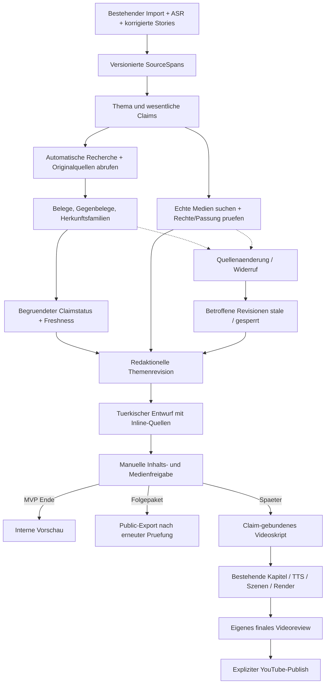
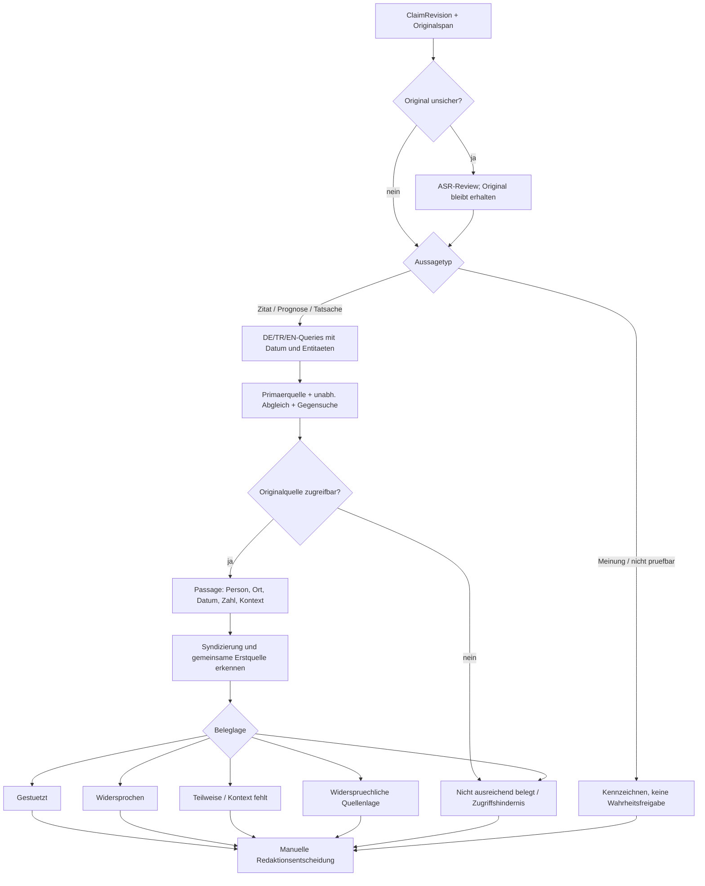
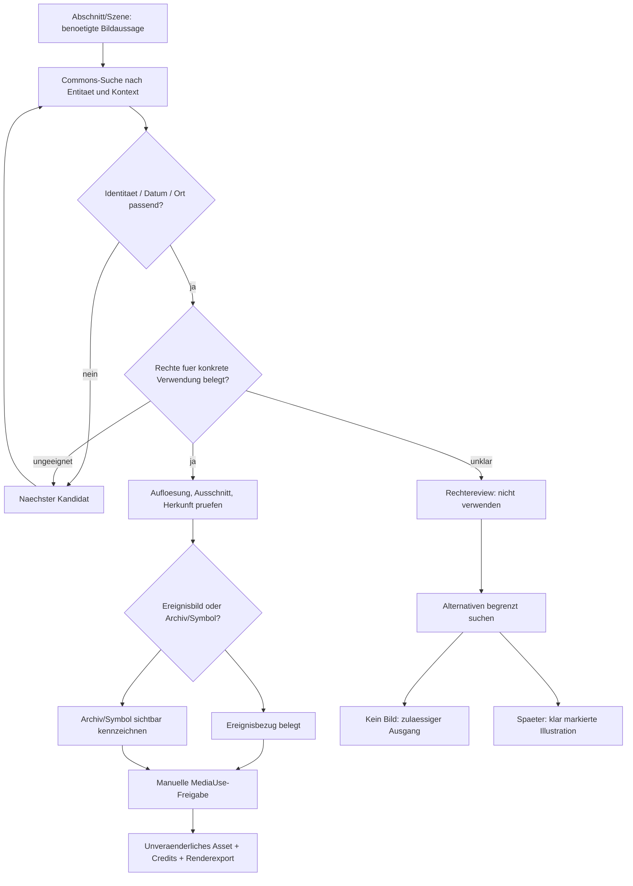
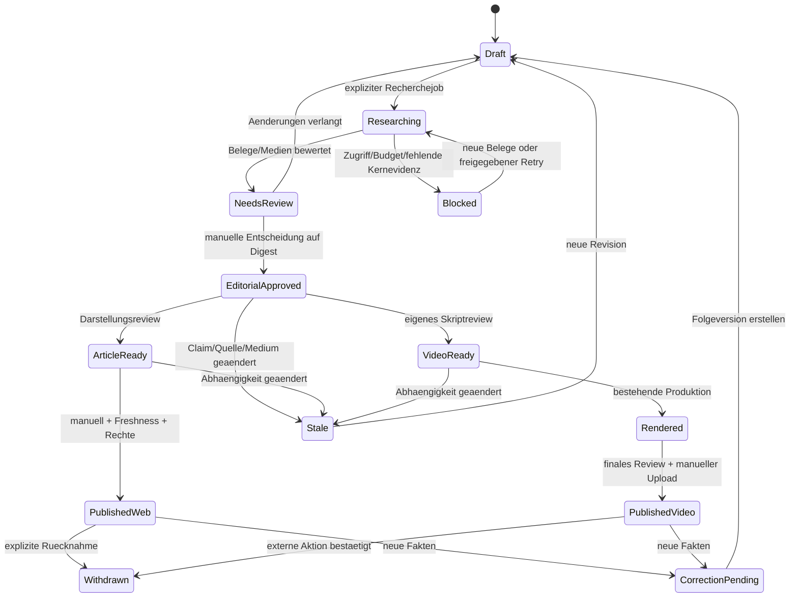
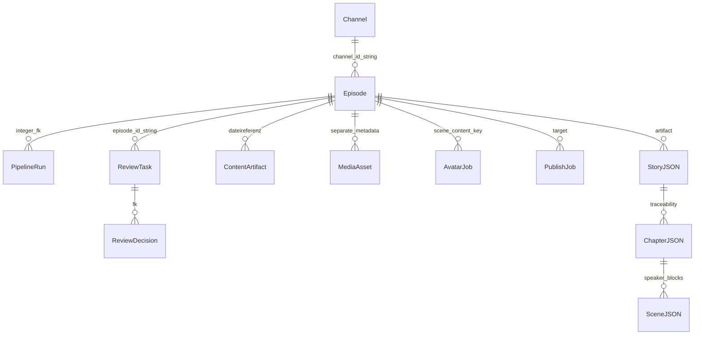
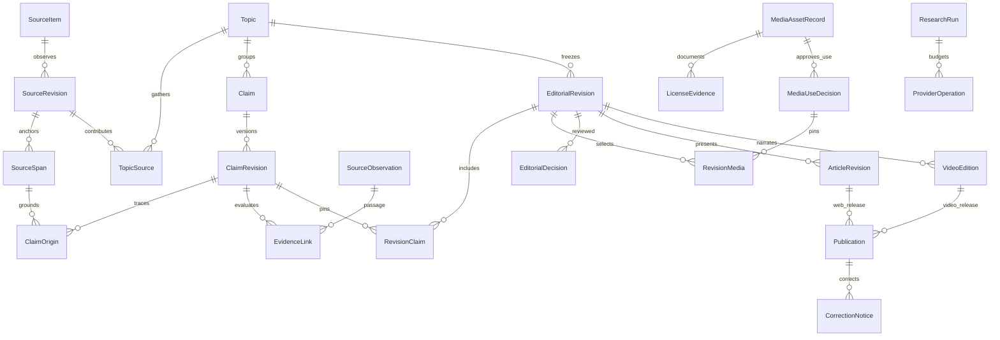

# ALMANYA24 Newsroom: vorgeschlagene Zielarchitektur

[Einstieg](../almanya24-news-platform.md) | [Ist-Zustand](../../review/almanya24-news-platform/current-system.md) | [Recherche](../../review/almanya24-news-platform/research.md) | [Arbeitspakete](work-packages.md) | [Fortschritt](progress.md)

**Alles in diesem Dokument ist Zielzustand**, sofern nicht explizit als
bestehender Erweiterungspunkt bezeichnet. Neue Namen, Modelle und
Konfigurationsschluessel sind Vorschlaege, keine heute nutzbaren Befehle.

## 1. Bestaetigter Produktzuschnitt

Der Betreiber hat festgelegt:

- ALMANYA24 bleibt die Marke.
- Schwerpunkt Deutschland und fuer Tuerkischsprachige relevante Weltmeldungen,
  einschliesslich Tuerkei, Politik, Wirtschaft, Gesellschaft und Sport.
  Das ist redaktionelle Priorisierung, keine technische Themenbegrenzung.
- Erster MVP: ein Thema aus vorhandener Transkription, **automatische**
  Claimextraktion, Belegsuche und Commons-Bildsuche, nachvollziehbare Bewertung,
  interner tuerkischer Artikelentwurf, ausschliesslich manuelle Freigabe.
- Manuelle Quellenergaenzung ist Fallback, nicht der automatische Hauptweg.
- Ohne ausreichende Belege/Medienrechte bleibt der Fall sichtbar offen.
- Oeffentliche Website direkt im folgenden Produktpaket.
- Kein Pressebildabo als Voraussetzung. Such-API-Zugang ggf. separat beschaffen;
  in diesem Auftrag keine Aktivierung und keine Ausgaben.

## 2. Architekturentscheidung

### Geprüfter Konfigurationsvertrag des Bestands

Die folgenden Namen existieren im Code am untersuchten Commit. Sie sind
keine vorgeschlagenen neuen Newsroom-Schalter.

| Name und Ebene | Tatsächliche Bedeutung und Codebeleg |
| --- | --- |
| `Settings.anchor_enabled`, Umgebungsvariable `ANCHOR_ENABLED` | Bool, Default `False`, `btcedu/config.py:213`. Schaltet die Avatarerzeugung frei, **nicht** Moderationstext, Sprecherrolle oder die gesamte Nachrichtenpipeline. |
| Deaktivierter Anchorpfad | `core/anchor_generator.py:160-172`: kein Providerauftrag; TTS_DONE/SCENE_PLANNED kann trotzdem zu ANCHOR_GENERATED fortschreiten. Dieser Status beweist also keinen erzeugten Avatar. |
| Renderverhalten bei `anchor_enabled=False` | `core/renderer.py:1978-1987`: Ein Szenenplan mit Studioszenen wird zugunsten des Kapitelpfads ignoriert. Reporter-only-Pläne bleiben möglich. Nicht mit „alle Szenenpläne deaktiviert“ gleichsetzen. |
| `stage_config.anchor.provider`, `.engine`, `.output_format` | Profilgesteuertes Routing, unabhängig vom Aktivierungsschalter. `resolve_anchor_config()` in `core/anchor_config.py:270-286` priorisiert Profilwerte vor Settings. Das Tagesschauprofil wählt HeyGen/Avatar III/WebM; dies aktiviert keine Aufträge. |
| `Settings.heygen_engine` / `heygen_output_format` | Generische Defaults sind `avatar_iv` / `mp4` (`config.py:205-209`), **nicht** der aufgelöste ALMANYA24-Vertrag. Andere Profile nicht pauschal auf Avatar III umstellen. |
| `ContentProfile.auto_publish` | Profilfeld, kein gleichnamiges `Settings`-Feld und kein hier belegter `AUTO_PUBLISH`-Envschalter. Modell-Default `True` (`profiles/__init__.py:33`), Tagesschau-YAML ausdrücklich `false` (Zeile 425). Verhindert im Pipelinepfad auch nach Freigabe den automatischen Upload (`pipeline.py:1665-1704`); expliziter manueller Publish bleibt grundsätzlich möglich. |
| `ContentProfile.auto_approve_reviews` | Profilfeld, Modell-Default `False`, Tagesschau `true` (YAML:424). Nicht als menschliche Prüfung interpretieren; neue Editorial-Gates erben es nicht. |
| `Settings.copilot_auto_fix_enabled` | Default `True` (`config.py:104`), steuert bestehende automatische Reparatur. Neue Recherchejobs dürfen diesen Hook nicht aufrufen. |

`Settings` lädt `.env` als UTF-8 (`config.py:360`); ein allgemeiner
projektspezifischer Env-Präfix ist dort nicht konfiguriert.
Diese Planprüfung hat keine `.env`-Werte ausgegeben oder geändert.
Die früher in dieser Analyse lesend festgestellten Laufzeitwerte sind
Momentaufnahmen, nicht allein aus Defaults abgeleitet.

### Unveränderliche Avatar-/Produktionsgrenzen

Auch bei späterer Videoanbindung bleiben für ALMANYA24 verbindlich:
HeyGen Avatar III; ein persistenter Look/ein Outfit pro Episode;
restartfähiges Jobledger mit sofort gespeicherter Provider-ID,
Budget für reservierte/ungeklärte Jobs und fail-closed Reconciliation;
Moderatorin im standardisierten Studio mit passendem Themenbild im Monitor;
unsichtbarer Reporter mit vollflächigen Medien; transparentes WebM bevorzugt,
opaker MP4-Fallback erhalten; Original-TTS als finales Audio.
Die vorhandene Medienpipeline wird weiterverwendet. Kein Paket aktiviert
`anchor_enabled`, `auto_publish` oder kauft reale Providerleistungen
ohne separaten ausdrücklichen Betriebsauftrag.

**Modularer Monolith plus spaeter statische oeffentliche Ausgabe.**
Bestehende ASR-/Story-/Review-/Medien-/Renderadapter erhalten; eine
redaktionelle Domaene ergaenzen, statt Artikelstatus in `EpisodeStatus`
hineinzupressen.

Vorgeschlagene Modulgrenzen:

| Komponente | Aufgabe | Anschluss |
| --- | --- | --- |
| `core/editorial/` | Thema, Claims, Belege, Revision, Freigabe, Abhaengigkeiten | Liest versionierte Stories/Transkriptspans nach `segment_broadcast`; unabhaengiger Side-Workflow |
| `services/source_search/` | `SearchProvider`-Protocol, erster Brave- oder Tavily-Adapter | Bestehendes Service-/Settings-/Mocking-Muster |
| `services/source_fetch.py` | Kontrollierter HTTP-Abruf, sichere Textextraktion, Quellenbeobachtung | Separat von LLM und Operatorrequests |
| `services/media_search/` | `MediaSearchProvider`, Commons zuerst | Medienkandidaten, keine implizite Freigabe |
| `core/media_rights.py` | Asset-/Verwendungsrechte, Nachweise und Policy | Erzeugt bestehende Render-Manifeste erst aus freigegebenen Verwendungen |
| `core/editorial_jobs.py` | Dauerhafte Jobs, Limits, Wiederaufnahme | SQLite, kurze Transaktionen; bestehender Worker kann Jobs ausfuehren |
| `web/editorial_api.py` und Templates | Interne Vorschau, Claimkarten, Medienvergleich, manuelle Entscheidungen | Vorhandene Auth/CSRF, keine Freischaltung unter PUBLIC_ENDPOINTS |
| `core/site_export.py` | Nur freigegebene Public-DTOs nach Jinja/HTML/RSS/Sitemap/Searchindex | Oeffentliche Ausgabe spaeter statisch ueber Caddy |

Keine neue Celery-/Redis-/Kubernetes-/Node-SSR-Infrastruktur im MVP.
Keine Umstellung aller bestehenden Stufen auf ein neues Framework.
Den zunehmenden Code in `pipeline.py`/`web/api.py` durch kleine delegierende
Anschluesse begrenzen. Redaktionelle Jobs bekommen **keinen**
`_trigger_automatic_copilot_fix`-Aufruf.

### Gemeinsamkeiten und Unterschiede von Artikel und Video

Die gemeinsame Wahrheit ist eine **redaktionell freigegebene Themenrevision
mit Claims, Evidenz und Medienentscheidungen**, nicht eine fertige
Uebersetzung der Originalsendung. Daraus entstehen unterschiedliche Formen:

- Artikel: eigenstaendige Struktur, wesentliche Fakten, Hintergrund und
  klar zugeordnete Quellen, nicht vollstaendige Uebersetzung/Abschrift.
- Videoskript: sprechbare Fassung, Moderation, Reporterbloecke, Timing;
  jeder Tatsachenblock verweist auf dieselbe Claimrevision.
- Beide behalten Zuschreibungen, Zahlen und Unsicherheit. Eine kuerzere
  Fassung darf keinen Vorbehalt abschneiden.
- Bildsuche/Evidenzpruefung einmal nutzbar, aber Rechte gelten je Verwendung:
  Website, Thumbnail, Video, Crop, Textoverlay und Ton koennen verschiedene
  Pflichten ausloesen.
- Vorhandene Episoden bleiben ihr eigener Produktionszweig. Der neue
  Artikelpfad setzt sie nicht auf APPROVED, startet keine TTS und aktiviert
  keinen Avatar. Videoanbindung folgt erst nach dem Websitepaket.

## 3. Diagramm 3: vorgeschlagener Gesamtfluss

Erweiterungspunkte: `Story.source_segment_ids`, `source_start_seconds`,
`source_text`, `core/segmenter.py`, `PromptRegistry`, Service-Protokolle,
vorhandene Reviewhash-/Renderinputlogik.
Neu: Themenrevisionen, Evidenzrelationen, Recherchejobs, MediaUseDecision,
Artikel- und Publikationsrevisionen, Invalidierung ueber Episodegrenzen.

Reviewfrage: Kann fuer jeden oeffentlichen Satz und jedes Bild erklaert
werden, auf welcher freigegebenen Revision er beruht? Wenn nein: kein Export.

## 4. Behauptungen und Belege

### Stabile Identitaet

- `SourceRevision`: Quelle/Edition, Originalsprache, Abruf, Medien-/Textdigest,
  Transkriptversion. Providerzeiten und Uploadzeit nicht mit Ereigniszeit
  verwechseln.
- `SourceSpan`: SourceRevision-ID, Originalsegment-IDs, Start/Ende in Sekunden,
  Zeichenoffsets und Zitat-/Textdigest. Fehlende Zeitstempel explizit `null`,
  nie aus geschaetzter Storydauer als exakte Originalzeit ausgeben.
- `Claim`: dauerhafte UUID innerhalb des Themenkontexts; **nicht**
  positionsabhaengiges `c01` und nicht ausschliesslich der Texthash.
- `ClaimRevision`: normalisierte Proposition plus Wortlaut, Typ, Person/
  Organisation, Ort, Ereigniszeit/Gueltigkeitszeit, Zahl/Einheit, Zuschreibung,
  Modalitaet, SourceSpan-Referenzen; unveraenderlich.
- Gleiche Extraktion derselben Quellrevision wird idempotent wiederverwendet.
  Aenderungen an Wortlaut/Segmentierung erzeugen neue Revisionen; unsichere
  Zuordnung zur bisherigen Claim-ID wird manuell bestaetigt.
- Belegstatus ist an ClaimRevision gebunden, nicht an einen frei editierbaren
  Satz. Neue Revision erbt niemals automatisch "gestuetzt".

### Claimtypen und Umgang

| Typ | Vorgehen |
| --- | --- |
| Moeglicher ASR-Fehler | Zur Audio-/Transkriptpruefung; passende Webstelle darf nicht still das Originaltranskript umschreiben |
| Tatsachenbehauptung | Dokumentbasierte Belegsuche und Kontextvergleich |
| Zitat / Zuschreibung | Originalquelle, Sprecher, Wortlaut/Paraphrase, Datum pruefen; "X sagt Y" getrennt von der Wahrheit von Y |
| Meinung / Wertung | Als Meinung kennzeichnen; enthaltene Fakten separat extrahieren |
| Prognose | Urheber, Zeitpunkt, Annahmen und Prognosecharakter erhalten; nicht als bereits eingetretenen Fakt bestaetigen |
| Nicht sinnvoll pruefbar | Begruendeter Status, keine scheinbare Bestätigung durch Modellwissen |

### Diagramm 4: Faktenpruefung

Bestehend: ASR-/Transcript-QA liefert Unsicherheitsmarker.
Neu: Claimklassifikation, SearchProvider, begrenzter Fetcher,
SourceObservation, EvidenceLink und Revisionsentscheidung.
Reviewfragen: Ist die Passage direkt tragfaehig? Sind Quellen wirklich
unabhaengig? Wird eine Zuschreibung als Ereigniswahrheit missverstanden?

### Evidenzvertrag

Jeder `EvidenceLink` verknuepft ClaimRevision mit konkreter Passage in einer
`SourceObservation`: Herausgeber, Titel, kanonische und abgerufene URL,
Veroeffentlichungs-/Aktualisierungsdatum soweit bekannt, Abrufzeit,
Originalsprache, Passage/Abschnitt/Seite, Inhaltsdigest,
`supports|contradicts|context|inconclusive`, begruendete Einordnung und
Herkunftsfamilie. Datum unbekannt bleibt unbekannt.

LLM kann Passagen vorschlagen und argumentieren, aber:

- kein URL-Erfinden, kein Bewerten nur aus Suchsnippet;
- zitierte Passage muss im tatsächlich abgerufenen Text auffindbar sein;
- Zahlen, Einheiten, Negationen und Entitaetszuordnung zusaetzlich
  deterministisch vergleichen;
- Originalsprache und Uebersetzung getrennt speichern;
- keine Wahrheitsprozente, kein pauschales "verifiziert"-Label fuer
  unzureichende oder nur durch Originalsender gestuetzte Claims;
- Syndizierungsfamilie aus ausgewiesener Agentur, Erstquelle, Zeitfolge,
  Zitaten und Textaehnlichkeit; im Zweifel Abhaengigkeit **unbekannt**,
  nicht "unabhaengig".

Ein Hash belegt gespeicherte Byteidentitaet, nicht Wahrheit, Aufnahmezeit
oder Echtheit. Die Echtheit des Ursprungsvideos bleibt getrennt
`authenticity_unassessed`, solange kein eigenstaendiger Provenienz-/Forensik-
Nachweis vorhanden ist.

### Unsicherheit, Aktualitaet und Korrekturen

`verdict`, `freshness`, `editorial_decision` sind getrennte Felder.
Eine wesentliche nicht ausreichend belegte Behauptung blockiert die
Freigabe der betreffenden Fassung. Redaktion kann sie entfernen,
mit Begruendung zurueckstellen oder eine neue, korrekt zugeschriebene
unsichere Fassung schreiben. Sie kann **nicht** per Override fehlende
Belege in "gestuetzt" verwandeln.

Vorlaeufige Recheck-Policy: Eilmeldungen/volatile Zahlen maximal 1 Stunde,
normale aktuelle Nachrichten 24 Stunden, stabile Hintergrunddaten 7 Tage
seit Pruefung. Das sind fachliche Planwerte, keine Garantie und keine
Terminschaetzung. Ereignisse koennen jederzeit sofortige Rechecks verlangen.
Jeder Publish-Auftrag prueft Frist, Quellrevision, Claim-/Medienentscheidungen
erneut. Auch ein alter Entwurf aus einer historischen Transkription braucht
eine klare Kennzeichnung seines Bezugszeitraums.

Geaenderte Quellen: neue Observation statt Ueberschreiben; Diff und
betroffene Claims ermitteln. Verschwundene Quelle: alten Beleg mit Abrufzeit
erhalten, aktuelle Zugaenglichkeit als eingeschraenkt markieren; alternative
primaere Quelle suchen. Archivdienst nur bei rechtlich zulaessigem Zugriff
und gekennzeichnetem Snapshot, keine Paywall-Umgehung.

Oeffentlich werden nur notwendige kurze Zitate/eigene Zusammenfassungen
und bibliografische Angaben publiziert. Volltexte nicht pauschal speichern
oder weitergeben: interner Cache nur soweit zulaessig, begrenzt, mit
Loeschfrist; laengerlebige Belegmetadaten/Passagen nach gepruefter Policy.
Hash ohne belegbare Passage ist kein Ersatz fuer einen Evidenznachweis.

## 5. Medienentscheidung

### Diagramm 5: Medienauswahl

Bestehend: `stock_images` Kandidaten/Ranking/Auswahl,
`MediaAsset`, FFmpeg-Normalisierung, Bild-/Videomanifest.
Neu: Commons-Adapter, Rechtebelege, Verwendungsrollen,
Asset-/Lizenzrevision und manuelle MediaUseDecision.
Reviewfragen: Ist das wirklich diese Person? Ist das Foto nur ein altes
Portraet? Erlaubt die Lizenz Crop, Video, Website und Monetarisierung?

Kandidatenrelevanz darf gewichtete technische Scores verwenden
(Entitaet/Kontext/Datum/Aufloesung); Rechte und irrefuehrende Verwendung
sind **harte Ausschlusskriterien**, keine durch hohe Scores kompensierbaren
Minuspunkte.

Pro Asset mindestens:

- Originaldatei- und Fundstellen-URL, Anbieter-ID, Urheber, Anbieter;
- gewaehlte Lizenz/Version/URL, Lizenzbeleg mit Revision/Abruf/Digest;
- erforderlicher Attributionstext und Platzierung;
- Abrufdatum, bekannte Aufnahmezeit/-ort und deren Nachweis;
- Beschreibung, Entitaeten, Bildrolle (`event`, `archive`, `symbol`,
  `illustration`), Original-/Derivative-Digest, MIME, Masse, Dauer;
- Bearbeitungen als Derivationskette (Crop, Resize, Farbe, Overlay);
- Nutzungsziel, Monetarisierung, Gebiet, Frist, Einschraenkungen;
- konkrete Verwendungsentscheidung, Grund, Operator, Zeit, Subject-Digest.

Ein Medienasset kann mehrere Herkunfts-/Lizenzangebote haben. Gleiche
Bytes per SHA-256 deduplizieren, Herkunftsbelege trotzdem getrennt erhalten.
Perceptual Hash erst spaeter als Kandidat fuer Near-Duplicates; er
entscheidet weder Rechte noch Ereignisgleichheit.
Metadaten-HTML von Commons ist untrusted, wird bereinigt und nie roh ins
Dashboard oder JSON-LD gerendert. EXIF ist ein Hinweis, kein Echtheitsbeweis.

MVP: Fotos, bevorzugt CC0/nachvollziehbare Gemeinfreiheit/CC BY mit
abgeschlossener manueller Nutzungspruefung. CC BY-SA nicht pauschal verboten,
aber bewusste Einzelfallpruefung; NC/ND/GFDL-Sonderfaelle vorerst ablehnen.
Keine generative Illustration automatisch als Ersatz fuer fehlende Rechte.
Ein fachlich passender Artikel ohne Bild ist ein valider, explizit
freizugebender Ausgang.

Spaeteres Rechteproblem: Asset `quarantined`, alle Verwendungen auffinden,
neue Exporte blockieren; Website-Version mit Ersatz/ohne Bild manuell
freigeben oder akut zurueckziehen. Bereits publiziertes YouTube-Video kann
nicht automatisch per lokalem Bildtausch korrigiert werden: separater
Operatorauftrag fuer Sichtbarkeit/Entfernung/Neuveroeffentlichung.
Eine spaetere Webseite mit anderem Lizenztext widerruft nicht automatisch
eine zuvor wirksam erteilte CC-Lizenz; Nachweise behalten, trotzdem Fall
redaktionell/rechtlich pruefen statt autonom entscheiden.

## 6. Revisionen, Freigaben und Publikationszustand

### Diagramm 6: Zustandsmodell

Das Diagramm ist eine fachliche Uebersicht, **kein einzelnes Enum**:
EditorialRevision, ArticleRevision, VideoEdition und Publication behalten
getrennte Status. Eine Websitekorrektur setzt ein vorhandenes Video nicht
stillschweigend auf zurueckgenommen. Die letzte oeffentliche Fassung und
ein neuer Entwurf koennen nebeneinander bestehen.

Bestehend: `ReviewTask`, Artifact-Hashes, manuelle Publishaktion.
Neu: Decisions pro SubjectRevision, Web-/Video-Release, CorrectionNotice,
Withdrawn-Tombstone und explizite Outputabhaengigkeiten.

Freigabevertrag: kanonischer Hash aus Inhalt, Claimrevisionen, Belegen,
Rechtestatus, ausgewaehlten Derivaten und relevanter Policyversion.
Optimistische Versionspruefung verhindert Freigabe eines zwischenzeitlich
geänderten Vorschaufensters. Veraltete Freigabe wird ungueltig, nicht
automatisch auf neue Dateien umgebunden. Bekannte harmlose Retrieval-
Metadatenupdates sind von inhaltlicher Aenderung getrennt, muessen aber
Freshness nicht durch blosse lokale Zeitstempelmanipulation erneuern.

Gemeinsame redaktionelle Freigabe bestaetigt Kernaussagen und Medien.
Artikeldarstellung und Videodarstellung brauchen jeweils eigene Freigabe.
Im Ein-Thema-MVP kann ein Operator beide noetigen Artikelentscheidungen in
einem Bildschirm bestaetigen; gespeichert werden sie getrennt.
Ungeklaerte Kernclaims oder ausgewaehlte Medien mit offenen Rechten
verhindern die Freigabe. Das bewusste Weglassen des Bildes ist keine
Rechtefreigabe dieses Bildes.

## 7. Diagramm 7: zentrale Datenmodelle

### Bestehende Modelle (I; Pfeile teils nur logische Referenzen)

Zuordnung: `models/episode.py`, `channel.py`, `review.py`,
`content_artifact.py`, `media_asset.py`, `avatar_job.py`, `publish_job.py`;
`story_schema.py`, `chapter_schema.py`, `core/scene_planner.py`.
StoryJSON/ChapterJSON/SceneJSON sind Dateien/Pydantic-Vertraege, keine
heutigen Tabellen. Channel-Pfeil ist insbesondere kein FK.

### Neue redaktionelle Domaene (Z)

Neu benoetigt: explizite Join-Tabellen statt fluechtiger Listen als einzige
Referenz. `MediaAssetRecord` ist der vorgeschlagene rechtefuehrende Bestand,
nicht eine sofortige Umbenennung der vorhandenen `MediaAsset`-Tabelle.
Der bestehende Renderbestand bekommt einen Adapter/Verweis auf diesen Bestand.
`VideoEdition` verweist spaeter auf vorhandene Episoden-/Kapitelproduktion.

DB-Regeln: unveraenderliche Revisionen; Unique Keys fuer stabile Quellen,
Claimrevisionen und Job-Inputhash; FK/Restrict innerhalb der neuen Domaene,
Indizes auf Claim-/Asset-/Publication-Rueckwaertsreferenzen.
Keine globale Aktivierung bisher ungepruefter SQLite-FKs auf Altbestand.
Neue Integritaet mit expliziten Pruefungen und passenden Verbindungen/
Migrationstests absichern, Alt-FK-Bereinigung gesondert.
Artikel-Suche wird neu aufgebaut; alte `chunks_fts`-Dokumentation ist keine
belastbare Artikel-Suchinfrastruktur.
N5 verwendet den beschriebenen statischen Suchindex, nicht zusätzlich
eine neue private FTS-Tabelle. FTS wäre erst für einen später begründeten
read-only Suchdienst zu planen.

Redaktionelle Daten und gecachte Quellen liegen unter einem **neuen privaten,
episodeunabhaengigen Root**, z.B. `data/newsroom/` (Planpfad).
Sie duerfen nicht im heutigen `outputs/<episode>/` liegen, das Retention
loescht und Remote Render teilweise als ganzes Paket transportiert.
Nur freigegebene kompakte Videoexporte gelangen in Episodenartefakte.
Artikel- und Belegreferenzen ueberleben Episode-Cleanup.

## 8. Oeffentliche Website als unmittelbares Folgepaket

### Technologiewahl

Jinja2 rendert versionierte, statische HTML-Dateien aus einem streng
allowlist-basierten `PublicArticle`-DTO. Caddy bedient ausschliesslich
ein eigenes Public-Exportverzeichnis. Kein Zugriff des Public-Servers
auf Produktions-DB, .env, Belegvolltexte, Vertragsreferenzen oder Logs.
Keine Wiederverwendung der Operator-App als oeffentliche App:
`create_app()` initialisiert DB und Jobs und besitzt private API-Routen.

Separater oeffentlicher Hostname ist vorzuziehen; Domain bleibt unentschieden.
Operator-Cookies bleiben hostgebunden und werden nicht als
Domaenen-Cookies geteilt. Wenn zuerst ein separater Pfad verwendet werden
muss, brauchen Routing/Static-Root/Cache/Path-Traversal eigene Abnahmetests.
Keine "temporäre" Freigabe von `/api/episodes`.

Features im ersten Websitepaket:

- Startseite mit Lead/aktuellen Meldungen und konfigurierbaren Rubriken;
- Artikelseite mit eigenstaendigem TR-Text, Belegverweisen, Bildcredit,
  Bildtyp, Erstveroeffentlichung, Updatezeit und Korrekturhinweis;
- stabile URL mit immutable Public-ID plus lesbarem Slug; Titelwechsel
  behaelt Canonical oder erzeugt explizite Weiterleitung, kein URL-Bruch;
- responsive Bilder/Styles, semantische Ueberschriften, Tastaturbedienung,
  Alttext und gute mobile Lesbarkeit;
- verwandte Artikel anhand Topic/Tags; keine unkontrollierte LLM-Empfehlung;
- JSON-LD `NewsArticle`, Canonical, Sitemap, RSS mit eigenen Kurztexten;
  `ClaimReview` nur nach gesonderter semantischer Pruefung, nicht fuer jede Meldung;
- kleiner Public-only-Suchindex mit tuerkischer Gross-/Kleinschreibung,
  Tests fuer I/i und die entsprechenden tuerkischen Varianten;
- Video optional als bewusst geladenes Embed, keine Autoplay-/Trackingpflicht.

Atomare Ausgabe: neues vollstaendiges Releaseverzeichnis schreiben,
Dateien/Referenzen pruefen, anschliessend Releasepointer atomar tauschen.
Die DB verzeichnet Release-ID und Publikationsabsicht; nach Crash gleicht
ein lokaler Reconciler Pointer und Publication ab. Kein Erfolg allein
aufgrund eines halbgeschriebenen HTML-Files.

Ruecknahme: Seite als Tombstone oder 410 mit verantwortlichem Hinweis,
aus Homepage/RSS/Suche entfernen, Sitemap/Cache aktualisieren.
Korrektur: stabile Artikelidentitaet, neue Revision und sichtbares
Aenderungsdatum/CorrectionNotice; keine heimliche Geschichtsaenderung.

Erst wenn ein gemessener Public-Suchindex zu gross wird (vorlaeufige
Abnahmegrenze 1 MiB komprimiert) oder dynamische Features wirklich benoetigt
werden, ist ein eigener read-only Public-Flask-Dienst zu pruefen.
Dann liest er eine getrennte Public-Projektion, nicht die Operator-DB.
Kein Nutzerkonto-, Kommentar-, Personalisierungs- oder Werbesystem im MVP.
Impressum, Datenschutz, verantwortliche Redaktion und Kontakt/
Korrekturweg sind Betreiberpflichten vor oeffentlicher Inbetriebnahme.

## 9. Betrieb, Untrusted Input und begrenzte Kosten

Alle folgenden Limits sind konfigurierbare **Planwerte**:

- Ein redaktioneller Job gleichzeitig auf dem Pi, niedrige Prioritaet;
  keine lokale grosse LLM-Inferenz. Kurze DB-Transaktionen, keine
  HTTP-Wartezeit bei gehaltenem Schreiblock.
- HTTP: 5 s Connect, 20 s Read, maximal 3 erlaubte Redirects;
  2 MiB dekomprimierter HTML-Text/Antwort, maximal 10 gelesene Belegseiten
  pro Revision; Querygesamtbudget gemaess Recherchevergleich.
- Gesamter ResearchRun: 10 Minuten Deadline; begrenzte Retries mit
  exponentiellem Backoff/Jitter und Retry-After, keine endlosen Pollschleifen.
- Bilddownload maximal 15 MiB, dekodierte Pixelzahl begrenzen
  (z.B. 40 Megapixel); Format sniffen, keine aktiven SVG-/HTML-Dateien
  ungeprueft anzeigen. MVP JPEG/PNG/WebP.
- Cache: Query+Sprache+Freshness+Providerversion, kurzer Negativcache;
  wiederverwendeter Lizenzbeleg darf vorgeschriebene Freshnesspruefung
  nicht aushebeln. Diskquote mit Warnung und fail-closed Abbruch.
- Neue bezahlte Calls werden **vor** Ausfuehrung als ProviderOperation
  reserviert. Unklarer Ausgang zaehlt konservativ gegen Topic-/Tages-/
  Monatslimit. Nicht mit bestehender PipelineRun-Abrechnung doppelt zaehlen.
- Requests, Trefferzahl, gelesene Belege, Cachehits, Statusgrund,
  Token-/Kreditkosten, Warte-/Laufzeit und Modell-/Policyversion erfassen.
  Logs enthalten keine Keys, Cookies, signierten URLs oder Rohprompts.

Fetcher akzeptiert nur http/https zu freigegebenen oeffentlichen Zielen.
Loopback, private/link-local/metadata IPs, Credentials in URLs,
lokale Dateien und verbotene Redirectziele ablehnen; DNS-/Redirectpruefung
bei jeder Verbindung, Proxyumgebung nicht blind uebernehmen.
Robots/Anbieterbedingungen beachten, keine Paywall- oder Bot-Schutzumgehung.
HTML-Scripts werden nicht ausgefuehrt; PDF/OCR/Headless-Browser spaeter
separat sandboxen, im MVP bei Bedarf `fetch_unsupported`.

LLM erhaelt nur begrenzte Datenpakete; Webseitenanweisungen sind zitierter
Inhalt, nie Befehle. Kein Shell-, Filesystem-, Netz-, MCP- oder Publishtool
im Bewertungsprozess; Schemaausgabe wird serverseitig validiert.
Das Modell darf Suchtexte vorschlagen, nicht beliebige Tools/URLs ausfuehren.
Queries vermeiden unnötige personenbezogene Rohdaten.

Retry und Idempotenz: ResearchRun-Schluessel aus Themen-/Quellrevision,
Policy, Modell und Operation; erfolgreiche Teilergebnisse wiederverwenden.
Pollbare Provider-IDs weiterverwenden; bei nicht pollbaren unklar
abgerechneten Requests keine behauptete Exactly-once-Garantie.
Ein erneuter Versuch benoetigt Budgetreserve und ggf. Operatorentscheid.
Neue Suchanbieter sind austauschbare Adapter, nicht neue Pipelinezweige.

## 10. Name und risikoarme technische Migration

| Ebene | Empfehlung | Nicht automatisch aendern |
| --- | --- | --- |
| Oeffentliche Marke | **ALMANYA24** (bestaetigt) | Domain/Marken-/Handleverfuegbarkeit ungeprueft |
| Produkt-/Architekturbezeichnung | **ALMANYA24 Newsroom** | Kein regional hartcodiertes Datenmodell |
| Repository/Distribution spaeter | `almanya24-newsroom` | Bestehende GitHub-URLs erst nach Workflowinventar umstellen |
| Python-Paket spaeter | `almanya24` | Aktuell `btcedu` stabil lassen |
| CLI spaeter | `almanya24`, mit altem `btcedu`-Alias | Kein Doppelstart von Jobs ueber zwei unabhaengige Implementierungen |
| systemd spaeter | `almanya24-web`, `almanya24-run` usw. | Nicht zwei aktive Timerfamilien parallel betreiben |
| Konfiguration | Bestehende unpraefixierte `WEB_*`, `ANCHOR_*`, Providerfelder zunaechst behalten | Heute kein allgemeiner `BTCEDU_`-Praefixvertrag gefunden |
| Daten-/Dateipfade | Bestehende Roots/DB behalten; neue Newsroomdaten nur explizit konfiguriert | Keine Massenverschiebung von Review-/Manifestpfaden |

Wenige Alternativen: `almanya24-platform` ist weiter, aber unspezifisch;
`almanya24-media` betont Ausgabe statt Evidenz/Redaktion.
**Newsroom** passt besser zur geplanten gemeinsamen redaktionellen Basis.
Die Marke laesst sich durch Rubriken erweitern, ohne Quellen auf Deutschland
oder eine einzelne Rundfunksendung zu begrenzen.

Tatsaechliche Abhaengigkeiten: `pyproject.toml` Distributionsname,
Package discovery und Entry point; `btcedu.*` Imports und Mockziele;
systemd ExecStart/WorkingDirectory, Timer-/Servicebeziehungen;
`run.sh`, `deploy/setup-web.sh`, Recorder-Trigger;
GitHub Deploy/Render/CI/Setup-Workflows;
Remote-Render-Reponame, Branch/SHA-Aufloesung und `python -m`-Aufrufe;
SQLite-URL, Artefaktpfade, Log-/Lockpfade, Sidecars, Runbooks und
moegliche ausserhalb des Repos installierte Units/Skripte.
Letztere wurden nicht vollstaendig inventarisiert: spaetere Migration
braucht Hostinventar, ohne Secrets auszugeben.

Stufen:

1. Oeffentliche/konzeptionelle Benennung jetzt planen, Technik unveraendert.
2. Repository-/Paketmetadaten nach abgeschlossenem MVP separat umstellen,
   CI-/Remote-Render-Referenzen und Dokumentlinks explizit pruefen;
   nicht auf GitHub-Weiterleitungen als dauerhaften Vertrag verlassen.
3. Neuen CLI-Alias zum **gleichen** Einstiegspunkt hinzufuegen.
4. Optional spaeter Paketumzug mit kleinen dokumentierten Re-Exports fuer
   unterstuetzte Altimporte; keine zweite Modellregistrierung/Base erzeugen.
5. Dienste kontrolliert migrieren: alte Timer stoppen, neue einzige
   Timerfamilie starten; Alias oder dokumentierte Umstellung, gemeinsames Lock.
6. Konfigurationsaliases nur bei Bedarf, Konflikte sichtbar ablehnen;
   nicht still "neu gewinnt" fuer sicherheitsrelevante Schalter.
7. Pfade zuletzt und nur bei belegtem Nutzen. Relative Roots bevorzugen;
   bestehende Hash-/Reviewbindung nach Umzug pruefen, keine Freigaben neu
   erfinden. Rueckfall auf alte Namen muss Daten/Jobs weiterfinden.

Abnahmekriterium der Umbenennung: alte und neue CLI adressieren denselben
DB-/Lock-/Jobbestand; Neustart und Remote Render funktionieren; keine
doppelten Timer, keine verlorenen Artefakte und keine spontan gekauften Jobs.
