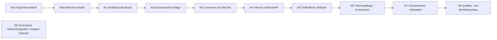

# ALMANYA24: priorisierte Arbeitspakete

[Einstieg](../almanya24-news-platform.md) | [Architektur und Diagramme](architecture.md) | [Belegte Befunde](../../review/almanya24-news-platform/findings.md) | [Fortschritt](progress.md)

**Gesamtplan zur sequenziellen Umsetzung freigegeben.** Jedes Paket wird
weiterhin separat abgegrenzt, geprueft und lokal committed.
Keine Termin-/Dauerschaetzung.
Migrationsnummern erst gegen den dann aktuellen HEAD vergeben, nicht
blind eine heute naechste Nummer reservieren.

## Reihenfolge und Liefergrenzen

N0a/N0b sind eng begrenzte Bestandssicherungen. **N1-N4 zusammen liefern
den ersten durchgaengigen MVP**, N5 ist unmittelbar das naechste
Produktpaket. Die Website wird nicht zugunsten einer grossen
Mehrquellen-/Videoneuentwicklung auf unbestimmte Zeit verschoben.
Korrektur/Ruecknahme fuer den ersten oeffentlichen Artikel muss bereits
N5 koennen; N6 skaliert und automatisiert die Abhaengigkeitsarbeit.
N9 ist technisch verschiebbar und kein Grund, das Produkt aufzuhalten.

Alle neuen redaktionellen Funktionen beginnen optional/deaktiviert;
vorhandene Profile laufen weiter. `anchor_enabled=false` und
`auto_publish=false` bleiben unveraendert. Keine automatischen Freigaben
aus `auto_approve_reviews` in den neuen Pfad uebernehmen.

## N0a: Importidentitaet und Zuordnung absichern

**Ziel/Nutzen:** R1-R3 beheben, damit Herkunft, Profil und Edition als
Grundlage aller spaeteren Claims verlaesslich sind.

**Voraussetzungen:** Neuer read-only Git-/Schemaabgleich; reproduzierte
Faelle aus dem Audit als unabgeschwaechte Regressionstests aufnehmen.

**Bestehende Module:** `core/detector.py`, `models/episode.py`,
`profiles/tagesschau_tr.yaml` nur zur Interpretation, bestehende
Detector-/Kanaltests. Keine produktive Profilumstellung erforderlich.

**Neue Komponenten/Modelle:** Kleiner gemeinsamer Importkontext und
kanonischer Broadcast-Key-Helfer; keine neue Newsroom-Domaene.
Key unterscheidet Quellserie, Edition und Sendedatum/-zeit/Zeitzone;
Feed/Recorder derselben Hauptausgabe passen zusammen.

**Schnittstelle und Bestandsschutz:** `failover/coordination.py:32-76`
besitzt bereits `canonical_broadcast_id()` mit Profil/Edition/Datum.
Vor neuem Helfer Wiederverwendung der reinen Parser prüfen. Den bestehenden
Lease-/Publish-Schlüssel **nicht** nebenbei ändern: persistente
Control-Plane-Ressourcen hängen daran. Ein Importvergleich benötigt zudem
Quellserien-/Kanalabgrenzung; Profil allein ist dafür kein Herkunftsnachweis.
Bei fehlenden Sendungsangaben keine scheinpräzise Uhrzeit aus Uploadzeit
erfinden. Gemeinsame Parserextraktion nur bei unverändertem Leasevertrag.

**Migration:** Zunaechst keine Datenmutation noetig. Herkunftsreparatur
fuer historischen Bestand nur als separat freizugebender Mappingbericht,
nicht beim normalen Detect.

**Abnahmekriterien:**

- Leerer fremder Feed veraendert keinerlei existierende NULL-Kanal-Episode.
- Podcast und Nachrichtensendung mit gleichem Titeldatum werden beide erhalten.
- 100-Sekunden- und Hauptausgabe desselben Tages werden beide importiert,
  unabhaengig von Batchreihenfolge.
- Feed und Recorder derselben Hauptausgabe werden weiterhin in beiden
  Importreihenfolgen dedupliziert; Mitternachtsupload bleibt korrekt.
- Backfill erzeugt explizites richtiges Profil und dessen v2-Version;
  bestehende v1-Episoden bleiben unveraendert.
- Unbekannte/mehrdeutige Edition wird nicht willkuerlich mit einer anderen
  zusammengelegt; sichtbare konservative Entscheidung statt Datenverlust.

**Gezielte Tests:** Bestehende `test_detector.py`,
`test_channel_assignment.py`, lokale Recorder-/Migrationszuordnungstests;
Parameterfaelle fuer Reuploads, Zeitzone, Titelvariation, Kanalwechsel,
unbekannte Quelle und Importreihenfolge. Feeds ausschliesslich Mock.
Zusätzlich `tests/test_failover_pipeline.py`, falls gemeinsame Parser
berührt werden: vorhandene Lease-/Publish-IDs müssen bytegleich bleiben.

**Kosten/Betrieb:** Keine externen Kosten, keine neuen Dienste.
Saubere Zuordnung kann bisher falsch verworfene Sendungen sichtbar machen;
dadurch moegliche spaetere Produktionsmenge separat beobachten.

**Risiko/Rueckfall:** Zu grober neuer Key blockiert legitime Inhalte,
zu enger Key erlaubt Duplikate. Regressionstestmatrix vor Umsetzung
festlegen. Code-Ruecknahme ohne Datenverlust moeglich; neu importierte
Episoden nicht zurueckloeschen.

## N0b: Ungeklaerte Jobs und ihre Belege vor Retention schuetzen

**Ziel/Nutzen:** R4 ursachennah beheben, bevor neue dauerhafte
Redaktionsreferenzen hinzukommen.

**Voraussetzungen:** N0a; tatsachlich vorhandene Avatar-/Publishstatus
gegen Modelle abgleichen.

**Bestehende Module:** `core/retention.py`, Avatar-/Publish-Jobmodelle,
Retentiontests. Bestehende Arbeits-/Kostenledger weiterverwenden.

**Neue Komponenten/Modelle:** Zentraler lesender Retention-Hold-Resolver
mit nachvollziehbarem Grund; erweiterbar um Editorial-Referenzen in N1.
Kein neues universelles Workflowframework.

**Migration:** Fuer reine Holdpruefung nicht erforderlich.
Auditaufbewahrung und spaetere zweiphasige Dateibereinigung explizit
entkoppeln; keine historischen Waisen loeschen. Die 184 verwaisten
PipelineRuns gesondert reporten, nicht automatisch "reparieren".

**Abnahmekriterien:**

- `reserved`, `submitted`, `reconcile_required` und ungeklaerte Uploads
  verhindern Datei- und Episodenloeschung auch ohne RUNNING-PipelineRun.
- Geschuetzte Episode mit Schutzgrund im Dry-Run-Bericht sichtbar.
- Geloeste Jobs koennen gemaess expliziter Aufbewahrungspolitik bereinigt
  werden, aber Kosten-/Auditbelege werden nicht still mitgeloescht.
- Kein Versuch, eine ungeklärte Provideraktion zur Cleanup-Entscheidung
  durch einen echten Provideraufruf zu "klaeren".

**Gezielte Tests:** Statusmatrix, gemischte Jobs, keine Jobs, Running,
abgelaufen/nicht abgelaufen, wiederholter Cleanup, PermissionError.
Dateiloescher und Provider gemockt.

**Kosten/Betrieb:** Geschuetzte Daten belegen bewusst laenger Speicher;
Warnung bei lange offenen Holds und Diskquote statt riskanter Autoloeschung.

**Risiko/Rueckfall:** Zu weite Holds verursachen Speicherwachstum.
Rueckfall ist Retention fuer betroffene Daten auszusetzen, nicht ihre
Sicherheitsbelege zu loeschen. Abbruch darf nie Erfolg vortaeuschen.

## N1: Versionierte redaktionelle Basis und dauerhafte Jobs

**Ziel/Nutzen:** Ein Thema aus vorhandener Story aufnehmen und
Quellbezug, Revisionen, Aufbewahrung und Budgets dauerhaft modellieren.

**Voraussetzungen:** N0b; SourceSpan-/Hash-/Decision-Vertraege aus
Zielarchitektur festlegen. Kein Providerkonto erforderlich.

**Bestehende Module:** `models/story_schema.py`, Transkriptschema,
`core/segmenter.py`, `db.py`, `migrations/`, Settings-/Profilmodell,
`web/jobs.py` als Ausfuehrungsanschluss, nicht als alleiniger Jobbestand.

**Neue Komponenten/Modelle:** Minimaler Slice aus SourceItem,
SourceRevision, SourceSpan, Topic/TopicSource, Claim/ClaimRevision/
ClaimOrigin, ResearchRun/ProviderOperation, EditorialRevision und
RevisionClaim; typisierte Schemas. Andere Tabellen erst im verbrauchenden
Paket. Episodeverweis optional, keine Artikel als fingierte Episode.

**Migration:** Additive Tabellen/Indizes/Unique Constraints. Fresh- und
Upgradepfad mit beiden bestehenden Metadata-Sets. Keine globale
FK-Aktivierung oder Umdeutung von EpisodeStatus; Anwendungskonsistenz
und neue FK-Vertraege explizit testen.

**Abnahmekriterien:**

- Import derselben Story zweimal erzeugt dieselbe Quell-/Claimrevision,
  keine zwei Topics ohne explizite Auswahl.
- Originaltext und Zeitbezug bleiben nach Textaenderung und Episode-
  Cleanup erhalten; bei fehlendem Span kein erfundener Zeitstempel.
- Atomare Jobreservation und konkurrierender Doppelstart ergeben
  hoechstens eine aktive logische Operation.
- Neustart nimmt gespeicherten Job auf; akzeptierte/unklare Operationen
  bleiben budgetiert.
- Neues Feature deaktiviert: bisherige Pipeline- und Webantworten unveraendert.
- Newsroomdaten sind ausserhalb von Episode-Retention und Remote-Renderpaketen.

**Gezielte Tests:** Revisions-/Identitaetstests, Wiederaufnahme nach
Reservation, Token-/Querybudget mit unbekanntem Ausgang, Migration
fresh/upgrade/idempotent, gleichzeitige DB-Reservation, Retentionreferenz.
Keine externe Providerfunktion erreichbar in diesen Tests.

**Kosten/Betrieb:** Nur DB-/Metadatenspeicher. Ein Rechercheworker, kurze
Transaktionen; Diskquote und Laufzeitlimit Teil des Jobvertrags.

**Risiko/Rueckfall:** Uebermodellierung vermeiden: nur verbrauchte Tabellen
implementieren. Feature abschalten laesst neue Daten lesbar bestehen;
Rollback entfernt keine Tabellen oder Revisionen.

## N2: Automatische Belegsuche und begruendete Claimpruefung

**Ziel/Nutzen:** Echte automatische Recherche, keine manuelle Linkliste
als scheinbarer MVP. Status pro Claim samt Gegenbelegen und Grenzen.

**Voraussetzungen:** N1; erster Suchanbieter und Tarif fuer einen spaeteren
Onlinepilot separat bestaetigt. Ohne Konto vollstaendige Fixtureausfuehrung.
Offizielle AGB-/Cachepruefung vor Aktivierung.

**Bestehende Module:** Service-Protokollmuster, PromptRegistry,
`services/claude_service.py` als Providerabstraktion; fuer untrusted
Belegtexte eigener daten-only Ausfuehrungsvertrag ohne Tools.
Transcript-QA dient als Hinweis, nicht als Faktenstatus.

**Neue Komponenten/Modelle:** SearchProvider (Brave vorlaeufig bevorzugt,
Tavily Basic alternative Beschaffungsoption), sicherer DocumentFetcher,
ClaimExtractor/Evaluator, SourceObservation und EvidenceLink;
Provenienzfamilien/Query-/Bewertungsartefakte.

**Migration:** Quellenbeobachtungen/EvidenceLinks, Indizes auf URL-Digest,
ClaimRevision und Herkunftsfamilie; Lookup-Caches mit Ablaufdatum.

**Abnahmekriterien:**

- Fuer maximal fuenf MVP-Kernclaims entstehen automatische Suchauftraege,
  Originalseitenabrufe und dokumentgebundene Ergebnisse.
- Alle sechs Claimstatus darstellbar; keine Wahrheitsprozente.
- Zitat/Meinung/Prognose/ASR-Unsicherheit werden korrekt abgegrenzt;
  Zahlen und Gewissheit ueber DE/TR/EN nicht still geaendert.
- Kopierte Agenturmeldungen zaehlen nicht als mehrere unabhaengige Belege.
- Snippet ohne gelesene passende Passage ist nie `supported`.
- Gegensuche wird dokumentiert; ein Widerspruch bleibt sichtbar.
- Unzugaengliche, geaenderte oder fehlende Quelle: begruendete Blockade
  oder manuelle Ergaenzung, niemals angeblich erfolgreiche Pruefung.
- Budget/Timeout/Retry-After eingehalten; Neustart behaelt Teilergebnisse.
- Prompt-Injection-Text kann weder Tools noch Auto-Fix/Commit/Publish ausloesen.
- Alle oeffentlichen URL-Abrufe durch denselben kontrollierten Fetcher.

**Gezielte Tests:** Deterministische lokale HTML-/JSON-Fixtures fuer
gestuetzt/widersprochen/teilweise/konflikt/nicht belegt/nicht pruefbar;
Negation, Waehrung, Datum, Aehnlichkeit mit falscher Person, alte Zahl,
Syndizierung, nicht existierendes Zitat; Fetchredirect auf private IP,
DNSwechsel, Kompressionsbombe, 403/404/429/5xx, falscher MIME, Budgetabbruch,
Resume nach Einzelclaim. LLM-/Suchantworten aus Mocks.
Kleiner von der Redaktion annotierter Fixturekorpus fuer Qualitaetsreview;
keine willkuerliche "90 Prozent wahr"-Abnahme.

**Kosten/Betrieb:** Obergrenzen und Beispielrechnung in
[Recherche](../../review/almanya24-news-platform/research.md); kein Onlinecall in CI.
Unklarer Abrechnungszustand zaehlt mit. Onlinepilot separat, begrenzt und
mit Operatorfreigabe, nicht Bestandteil dieses Planauftrags.

**Risiko/Rueckfall:** Quellenabdeckung/Fehlinterpretation.
Redaktionelle Sperre bleibt bestehen; Suche abschaltbar, manuelle Belege
als sichtbarer Ersatz. Anbieterwechsel muss Ergebnisse/Belege erhalten,
nicht automatisch neu abrechnen.

## N3: Commons-Medien mit assetbezogener Rechteentscheidung

**Ziel/Nutzen:** Automatisch passende echte Bildkandidaten statt
dokumentarisch wirkender KI-Bilder als Standard fuer den neuen Artikelpfad.

**Voraussetzungen:** N2, relevante Topicentitaeten vorhanden.
Commons-Nutzungs-/APIvertrag und User-Agent festgelegt.

**Bestehende Module:** `stock_images.py` Kandidaten-/Auswahllogik,
`MediaAsset`, bestehende Normalisierung/Manifeste und Dashboardmuster.
Keine neue parallele Bildrenderpipeline.

**Neue Komponenten/Modelle:** CommonsMediaProvider, rechtefuehrender
MediaAssetRecord, LicenseEvidence, MediaUseDecision, RevisionMedia,
Download-/Derivative-Caches und Attributionsexporter.

**Migration:** Additive Medienrechte-/Verwendungstabellen und
Rückwaertsreferenzen. Bestehende Pexels-/Frameassets werden **nicht**
automatisch als nachweislich freigegeben migriert.

**Abnahmekriterien:**

- Automatische Kandidatensuche mit konkreter Bildabsicht.
- Identitaet/Kontext/Datum und konkrete Website-Verwendung pruefbar.
- Lizenz/Version/Urheber/Quelle/Abruf/Beleg/Attribution dauerhaft vorhanden.
- Crop/Bearbeitung und Archiv-/Symbol-/Ereignisrolle sichtbar.
- Unklare Rechte und falscher Ereignisbezug durch Ranking nicht heilbar.
- Identische Bytes nur einmal gespeichert, mehrere Quellen-/Lizenzangebote
  trotzdem separat nachvollziehbar.
- Kein geeigneter Kandidat ist ein valider Ausgang; keine versteckte
  kostenpflichtige oder generative Ersatzproduktion.
- Gesperrtes Asset kann nicht in die Artikelfreigabe gelangen.

**Gezielte Tests:** CC0/BY/BY-SA/NC/ND/unbekannt/Mehrfachlizenz,
Uploader ungleich Urheber, fehlendes Datum, falsche Person, altes Portraet,
schadhaftes extmetadata-HTML, zu grosse/kaputte Bilder, Dubletten,
Cache/Neustart, widerrufene interne Verwendung, Credits nach Crop.
Alle Commons-/Medienantworten gemockt.

**Kosten/Betrieb:** Keine Pressebildlizenzkosten fuer den MVP vorausgesetzt;
Providerbedingungen und Fair Use trotzdem beachten. Kleine sequenzielle
Batches und Miniaturvorschauen, begrenzter Bildcache.

**Risiko/Rueckfall:** Commons-Katalogangaben sind keine Rechtsgarantie.
Manuelle Freigabe und bewusst kein Bild bleiben zulaessig.
Neuen Adapter abschalten beruehrt alte Profile nicht.

## N4: Tuerkischer Artikelentwurf und interne Freigabe -- MVP-Abschluss

**Ziel/Nutzen:** Ein vollstaendiges Thema intern reviewen: vom Originalspan
ueber automatische Evidenz/Medien bis zum eigenen lesbaren Artikel.

**Voraussetzungen:** N1-N3; kein Publichost und keine Videoproduktion noetig.

**Bestehende Module:** Operator-Auth/CSRF, Webtemplates, PromptRegistry,
Reviewhashmuster, Sprach-/Zahlenvalidierung aus QA wo passend.

**Neue Komponenten/Modelle:** ArticleRevision, EditorialDecision,
Darstellungsentscheidung; Editorial-API/Reviewansicht, Claim-zu-Absatz-
Mapping, strikt privater Previewexport.

**Migration:** Artikelrevisionen, Entscheidungen und Layout-/Policyversion.
Keine Aenderung bestehender Reviewstatus fuer Altprofile.

**Abnahmekriterien:**

- Ein ausgewaehltes Transkriptthema durchlaeuft automatisch N2 und N3,
  liefert eigenen TR-Entwurf mit Inline-Belegen und passendem Bildnachweis.
- Kein ungepruefter Kernclaim wird durch Artikelerzeugung hinzuerfunden.
- Jede wesentliche Artikelaussage referenziert freigegebene Claimrevisionen;
  Zitate, Zahlen und Unsicherheit bleiben erhalten.
- Offene Kernbelege oder Rechte verhindern Freigabe; Bild explizit
  weglassen oder Claim ueberarbeiten erzeugt neue Fassung.
- Nur authentifizierter Operator mit CSRF kann manuell freigeben;
  globale Autoapprove-Einstellung kann dies nicht umgehen.
- Text-/Beleg-/Medienaenderung zwischen Vorschau und Klick macht
  alte Freigabe ungueltig.
- Kein oeffentlicher Export, kein Upload, kein TTS/Avatar-/Mediengenerierungsjob.

**Gezielte Tests:** End-to-End mit In-Memory/Temp-DB und Providermocks,
Neustart mitten in Recherche, erneuter Draft ohne Doppelabrechnung,
Anon401/CSRF403, stale decision, privater Previewzugriff, HTML-Injection,
unvollstaendige Attribution, unzulaessiges LLM-Zitat.

**Kosten/Betrieb:** Artikelerzeugung innerhalb des Themen-LLM-Budgets,
keine zweite unbudgetierte "Finalisierung". Interne Vorschau klein.

**Risiko/Rueckfall:** Stilistisch gute Texte verdecken Evidenzluecken.
Review zeigt Belege/Unsicherheit neben dem Text. Feature deaktivieren
laesst Entwuerfe/Audit lesbar, Altvideo laeuft unveraendert.

**MVP ist erst abgenommen**, wenn ein reproduzierbarer Fixturefall das
gesamte automatische Verfahren und ein negativer Fall die reale Sperre
zeigen. Ein spaeter erlaubter begrenzter Onlinepilot bewertet Quellen-
und Medienqualitaet separat; er ist keine Voraussetzung fuer heutige Planung.

## N5: Eigenstaendige oeffentliche Nachrichtenwebsite

**Ziel/Nutzen:** Direkt nach dem MVP freigegebene Themen lesbar anbieten,
ohne das Operator-Dashboard oeffentlich zu machen.

**Voraussetzungen:** N4; Betreiberentscheidung zu Domain, Impressum,
Datenschutz, Redaktion/Korrekturkontakt und konkreten Nutzungsrechten.
Oeffentliche Inbetriebnahme weiterhin eigener expliziter Auftrag.

**Bestehende Module:** Jinja2, bestehende Caddy-/Deploydokumentation
als Betriebsmuster; keine Public-Ausnahmen an Operator-APIs.

**Neue Komponenten/Modelle:** PublicArticle-DTO, SiteExporter,
Publication/Release und minimaler CorrectionNotice-/Withdrawal-Pfad,
separates statisches Releaseverzeichnis.

**Migration:** Public-ID, Release-/Publikationsjournal und
darstellungsbezogene Revisionen. Kein Publiczugriff auf private DB.

**Abnahmekriterien:**

- Startseite/Rubriken/Artikel, Quellen, Medienkennzeichen, Daten,
  Relatedlinks, mobiles Layout und Public-only-Suche funktionieren.
- Stabile Canonical-URLs, NewsArticle-JSON-LD, Sitemap und RSS aus
  freigegebenen eigenen Inhalten; keine internen Tokens/Notizen.
- Vor jedem Export Freshness/Claims/Rechte erneut pruefen.
- Manueller Publish, atomarer Releaseswitch und Crash-Reconciliation;
  keine teilweise oeffentlichen Artikel.
- Korrektur erzeugt sichtbaren Hinweis; Ruecknahme entfernt Artikel
  aus Suche/Feeds und zeigt definierten Tombstone/410.
- Domain-/Pfadtrennung laesst weder .env, DB, interne Belege noch
  Operator-Cookies oeffentlich werden.
- Kein laufender Node-/SSR-/DB-Prozess fuer reine Publicseiten notwendig.

**Gezielte Tests:** Public-DTO-Allowlist, versteckte/private Felder,
unerlaubte Dateipfade, stale evidence, HTML-Escaping,
simulierter Crash vor/nach Pointerwechsel, Links/Canonical/RSS/Sitemap,
TR-Suche, Zuruecknahme, Cookie-/Routinggrenzen, mobile Bedienung mit
vorhandenen Werkzeugen. Kein neues Tool nur fuer optisch gruene Ergebnisse.

**Kosten/Betrieb:** Statisches Hosting auf bestehendem Pi/Caddy moeglich;
Domain/TLS-/Betriebsentscheidung separat. Responsive Bilder/Cacheheader,
vorlaeufig maximal 1 MiB komprimierter Suchindex.

**Risiko/Rueckfall:** Versehentlicher Export privater Daten oder
inkonsistente Releases. Publicrelease zurueckziehen/Pointer auf letzte
gueltige Fassung; keine private DB aus Backup zuruecksetzen.
Bei Rechteproblem kein Rollback auf erneut rechtsproblematische Version.

## N6: Themenbuendelung, Aktualisierung und dauerhafte Korrekturen

**Ziel/Nutzen:** Mehrere Sendungen/Quellen zu einem fortlaufenden Thema
zusammenfuehren und aenderungsabhaengige Inhalte systematisch pflegen.

**Voraussetzungen:** N5 mit bereits funktionsfaehiger Einzelkorrektur.

**Bestehende Module:** SourceSpan-/Story-Mapping, neuer Revisionsgraph,
Retention-Holds, Schedulerprinzip. Keine automatische Artikelpublikation.

**Neue Komponenten/Modelle:** Topic-Merge-/Split-Entscheidungen,
kanonische Entitaetsreferenzen, PublicationDependency, RecheckJobs,
Quell-/Assetproblem-Inbox und Aufbewahrungspolicy.

**Migration:** Themenaliases, historische Mergebeziehungen,
Abhaengigkeits-/Freshnessindizes; bestehende Publikations-IDs stabil.

**Abnahmekriterien:**

- Eine Sendung kann mehrere Artikelentwuerfe liefern; mehrere Quellen
  koennen eine Themenrevision tragen.
- Wiederholte Meldung erzeugt Updatevorschlag statt automatisch
  doppeltem Artikel. Datum/Entitaet allein reicht nicht zum Zusammenlegen.
- Merge/Split braucht nachvollziehbaren Operatorentscheid, bleibt reversibel.
- Geaenderte wesentliche Quelle oder Assetrechte zeigen alle betroffenen
  Entwuerfe/Website-/Videoverwendungen.
- Recheckjob kann sperren oder Review anfordern, niemals selbst freigeben.
- Dauerhafte Publikations-/Rechtebelege ueberleben Episode-Retention;
  Cachebytes unterliegen davon getrennter Loesch-/Aufbewahrungspolitik.

**Gezielte Tests:** Zwei Editionen/ein Thema, gleiche Person/verschiedene
Ereignisse, Mehrquellenkonflikt, Merge/Split-Reversal, Fanout,
gelöschte Quelle, geaenderte Lizenzmetadaten, doppelte Recheckjobs,
Crash zwischen Datei-/DB-Cleanup in isolierter Testablage.

**Kosten/Betrieb:** Rechecks sind budgetierte ProviderOperationen.
Stichwort-/Datum-/Entitymatching zuerst; keine lokalen Embeddingcluster
ohne belegten Nutzen. Wachsendes Belegarchiv mit Quote/Retentionklassen.

**Risiko/Rueckfall:** Falsche Themenfusion und Kosten durch Rechecksturm.
Mergevorschlaege manuell, bounded fanout und Budgetstop; Hintergrund-
Rechecks abschalten laesst bestaetigte oeffentliche Versionen nachvollziehbar.

## N7: Videos aus derselben redaktionellen Revision

**Ziel/Nutzen:** Artikel und Video nutzen dieselben geprueften Kernaussagen
und bewusst freigegebenen Medien, ohne vorhandene Produktion neu zu bauen.

**Voraussetzungen:** N6; Rechte fuer Video/Crop/Attribution separat
bestaetigt. Avataraktivierung ausdruecklich **nicht** Teil dieses Pakets.

**Bestehende Module:** `scripter.py`, `script_qa.py`, `chapterizer.py`,
`narration_lock.py`, `stock_images.py`, TTS, Sceneplan, Renderer,
Renderinputcollector, Remote Render, Publisher.

**Neue Komponenten/Modelle:** VideoEdition, Editorial-to-Script-Adapter,
Claim-zu-Speakerpart-Mapping, Medienexport mit Bildrolle/Credit;
separate Skript-/Finalvideoentscheidungen.

**Migration:** EditorialRevision-/VideoEdition-/Episodebeziehungen
und Derivatabhaengigkeiten, keine Umschreibung vorhandener Episoden.

**Abnahmekriterien:**

- Neues optionales Profilrouting konsumiert EditorialRevision statt
  erneut unkontrolliert Originalsendung zu adaptieren.
- Fachliche Inhalte/Unsicherheit bleiben mit Artikelrevision konsistent,
  trotz unterschiedlicher Dramaturgie/Laenge.
- Original-TTS bleibt Finalaudio; Altpfad und deaktivierter Avatar
  bleiben unveraendert.
- Archiv-/Symbol-/Illustrationshinweise und noetige Attribution sichtbar
  im Video und vorgesehenen Metadaten.
- Claim-/Medienrevision invalidiert betroffene Skript-/Renderfreigabe.
- Remote-Paket enthaelt nur freigegebene Renderinputs, keine privaten
  Recherchebelege/Vertragsdokumente.
- Finales Videoreview und manueller YouTube-Publish separat;
  kein automatischer Upload durch Artikelfreigabe.

**Gezielte Tests:** Neues Routing off/on, Claimdrift, Sprachzahlen,
Reporter/Anchor/Wetter-Bestandspfade, Renderinput-Aenderung,
MediaUse-Lizenz fuer falschen Kanal, Remote-Allowlist, Altprofile,
Resume und kostenfreier synthetischer Video-Smoke-Test.
TTS/HeyGen/Bild-/YouTube-Dienste immer Mock.

**Kosten/Betrieb:** Bestehende Videokosten bleiben; zusaetzliche
Claimvalidierung budgetieren. Reines Rendering vorhandener Audiodateien
startet keine neue TTS. Wird die TTS-Stufe ausdrücklich erneut ausgeführt,
gilt weiterhin der vorhandene Fresh-Take-Vertrag: **kein neuer Takecache**.

**Risiko/Rueckfall:** Skriptkohaerenz und technische Hashinvalidierung.
Neues Routing abschaltbar, bestehende Produktionsprofile weiter nutzbar;
deren Ausgaben nicht als nach diesem neuen Verfahren geprueft bezeichnen.

## N8: Quellen-, Medien- und Betriebsqualitaet erweitern

**Ziel/Nutzen:** Nach belegtem MVP-Nutzen gezielt Abdeckung und Betrieb
verbessern, nicht beliebige Provider gleichzeitig anbinden.

**Voraussetzungen:** Metriken und konkrete ungelöste redaktionelle Faelle
aus N2-N7, gesonderte Anbieter-/Kostenfreigaben.

**Bestehende Module:** Neue Providervertraege, `pipeline.py` Profilvalidierung,
Kosten-/Fehlerberichte, Dashboard, bestehende Testinfrastruktur.

**Neue Komponenten/Modelle:** Pro Folgepaket genau ein benoetigter Adapter
(z.B. EU AV manuelle Fundstellen oder Openverse), Qualitaets-/Quellenreport.
Aktuelle Presse-/Sportbilder nur nach eigenem Vertrag.

**Migration:** Nur fuer nachgewiesene neue Metadaten; keine leeren
Vorratstabellen. Profilplanvalidierung kann ohne Schemaaenderung erfolgen.

**Abnahmekriterien:**

- Anbieterwechsel hinter demselben Vertrag, keine neue Autoapprove-Luecke.
- Coverage/Kosten/Fehlklassifikationen anhand annotierter Faelle erkennbar.
- Ungueltiges Profil liefert vor Stufenstart expliziten Fehler
  statt Defaultplan (A8); Legacyprofile bleiben getestet.
- Ungeklaerte Review-/ASR-Cache-Verdachtsfaelle aus dem Audit werden
  jeweils erst reproduziert und dann in einzelnen Fixpaketen bearbeitet.
- Speicher-/Retry-/Budgetmetriken erlauben verantwortlichen Betrieb.

**Gezielte Tests:** Anbietercontract, Cache/RateLimit, Lizenzregression,
invalid profile, Quellenbias-/Syndizierungsfaelle, Altprofilmatrix.

**Kosten/Betrieb:** Neue Abos, mehr Calls und Speicher nur mit
vorherigem Budget; kein pauschaler Anbieter-Fallback.

**Risiko/Rueckfall:** Ausbauschritte koennen unueberschaubar werden:
dieses Paket vor Umsetzung in **einzelne Adapter/Fixes** schneiden.
Jeweiligen Adapter deaktivieren, gespeicherte Belege erhalten.

## N9: Technische Namen schrittweise migrieren

**Ziel/Nutzen:** `almanya24-newsroom`/`almanya24` technisch etablieren,
ohne einen Markenwechsel mit riskanter Infrastrukturmigration zu verwechseln.

**Voraussetzungen:** Abhaengigkeitsinventar im Repo **und** Host,
Domain-/Markenfrage separat. Keine Voraussetzung fuer N1-N8.

**Bestehende Module:** `pyproject.toml`, Importpfade, CLI, `deploy/`,
`run.sh`, GitHub Actions/Remote Render, Tests, Konfiguration und Runbooks.

**Neue Komponenten/Modelle:** Zuerst CLI-Alias, danach optional explizite
Importkompatibilitaet und Dienstealias. Kein neues Inhaltsmodell.

**Migration:** Keine DB-/Pfadumbenennung als Default. Ein spaeterer
begruendeter Pfadumzug benoetigt eigenen manifest-/hashsicheren Plan.

**Abnahmekriterien:**

- Alte/neue CLI nutzen gleichen Einstiegspunkt, DB, Jobbestand und Lock.
- Genau eine aktive Timerfamilie, keine Doppelarbeit.
- CI und Remote Render beziehen richtigen Repo-/Commitstand.
- Bestehende Artefakte/Reviews/Provider-IDs bleiben auffindbar und gueltig.
- Widerspruechliche Konfigurationsaliases werden sichtbar abgewiesen.

**Gezielte Tests:** Import-/CLI-Kompatibilitaet, install/build nach
bestehendem Verfahren, Service-Unit-Referenzen, Repo-/Remote-Vertrag,
Pfad-/Hashroundtrip. Keine Provideraktion.

**Kosten/Betrieb:** Kein neues laufendes Produkt, aber vorsichtiger
Rollout mehrerer kleiner Umbenennungen.

**Risiko/Rueckfall:** Harte externe Pfade und doppelte Modellregistrierung.
Vorherige Namen bleiben bis expliziter spaeterer Abschaffung unterstuetzt.
Konkrete Namensschritte separat abnehmen; kein Grossumzug in einem Commit.

## Gemeinsame Abnahmematrix

### Verbindliche Paketübergaben

Alle folgenden Typnamen sind **vorgeschlagene Verträge**, keine bereits
vorhandenen importierbaren Klassen. Ihre Definition gehört dem genannten
Paket; Folgepakete referenzieren dieselbe Definition, statt sie zu kopieren.

| Eigentümer | Eingabe → persistente Ausgabe | Fehler-/Freigabegrenze |
| --- | --- | --- |
| N0a | Validiertes Profil + expliziter Kanal + SourceInfo → Episode/Importentscheidung | Mehrdeutige Herkunft nicht durch globales Backfill „reparieren“ |
| N0b | Episode + bestehende Jobstatus → RetentionHold mit Grund | Ungeklärt bedeutet behalten; kein Providerzugriff |
| N1 | Bestehende Story/Originalsegmente → SourceRevision/Spans/Topic, ResearchRun | Stabile IDs, Inputdigest, Schema-/Policyversion, Reservation |
| N2 | Topic-/SourceRevision → ClaimRevision + EvidenceLinks/Status/Usage | Originalpassage zwingend; Tool-/Budget-/Fetchfehler bleiben sichtbar |
| N3 | Topicentitäten + konkrete Bildabsicht → Kandidaten + LicenseEvidence + MediaUseDecision | Ranking ≠ Freigabe; ungeklärte Rechte blockieren die Verwendung |
| N4 | Gepinnte Claims/Medien → EditorialRevision/ArticleRevision/Entscheidungen | Inhalt und Darstellungsfreigabe manuell und digestgebunden |
| N5 | Aktuelle freigegebene ArticleRevision → PublicArticle/Release/Publication | Erneuter Freshness-/Rechtecheck; nur Public-Allowlist |
| N6 | Neue Observation/Quarantäne → betroffene Revisionen/Recheckaufträge | Keine automatische Neufreigabe oder irreversible Themenfusion |
| N7 | EditorialRevision + Video-MediaUse → VideoEdition + bestehende Produktionsartefakte | Eigenes Video-Gate; keine privaten Belege im Remote-Paket |
| N8 | Konkret freigegebener Anbieterbedarf → einzelner Adapter unter bestehendem Vertrag | Vor Umsetzung separat schneiden, keine pauschale Ausbauermächtigung |
| N9 | Inventar bestehender Namen → kompatible Aliase/Umstellung | Optional, eigener Auftrag, keine Doppelregistrierung/-timer |

Providerantworten enthalten mindestens Request-/Operation-ID,
Eingabehash, Provider-/Modellversion, Status, Ergebnisreferenzen und Usage.
Kostenunsicherheit ist ein eigener Zustand, keine Nullkosten-Fallbackzahl.
Serialisierte Schnittstellen erhalten Schema-Version und Validierung;
keine unversionierten freien JSON-Dicts als Freigabevertrag.

| Grenze | Nachweis vor Paketabschluss |
| --- | --- |
| Bestandsschutz | Betroffene vorhandene Tests unveraendert plus neue Regression; neue Flags off liefert bisheriges Verhalten |
| Migration | Frische Temp-DB, Upgrade aus kopiertem/fixturesbasiertem Altstand, wiederholte Migration, keine Produktionsmigration im Test |
| Idempotenz | Prozessabbruch nach Reservation/Antwort/Dateischreiben/Commit; keine verlorene Kostenschuld oder stilles Doppelpublizieren |
| Freshness | Text-, Quellen-, Lizenz- und Bildaenderung invalidieren genau betroffene Freigaben, nicht fremde Themen |
| Editorial | Offene Kernevidenz/Medienrechte bleiben blockiert, auch bei aktivem globalem Autoapprove |
| Untrusted Input | Webseiten-/Metadatenanweisungen bleiben Daten; keine Tool-/Datei-/Netz-/Publishrechte des Modells |
| Publicgrenze | Allowlist-Export enthaelt nur freigegebene Inhalte, keine Rohtexte/Secrets/interne Notizen |
| Kosten | Reserviert/akzeptiert/unklar mitzaehlen; kein Retry jenseits Limits, kein stiller kostenpflichtiger Fallback |
| Sprache | DE/TR/EN: Zahlen, Namen, Zeitbezug, Zuschreibung und Unsicherheit konsistent |
| Betrieb | Ein bounded Worker, kurze DB-Locks, begrenzte Dateien/Downloads, sichtbare Blockade bei Ressourcenmangel |

Bei Umsetzung: zuerst kleinste relevante vorhandene pytest-Auswahl und
Ruff fuer betroffene Dateien; bei Aenderungen an gemeinsamen Pipeline-,
Schema-, Auth- oder Publikationsgrenzen zusaetzlich Integrationsmatrix und
vollstaendige Suite vor Paketfreigabe. Baselinefehler separat dokumentieren,
nicht Tests abschwaechen. Reine Dokumentationsaenderungen brauchen keine
erneute lange Suite. In dieser Planung wurden keine solchen Laeufe gestartet.

## Wirklich offene Betreiberentscheidungen

1. **Vor Onlinepilot N2:** Brave oder Tavily Basic, konkreter Account/Tarif
   und maximal erlaubtes Budget. Empfehlung/Planwerte liegen vor;
   keine Beschaffung in diesem Auftrag.
2. **Vor Publicbetrieb N5:** Domain/Host, verantwortliche Redaktion,
   rechtliche Seiten/Korrekturkontakt und rechtliche Beurteilung
   vorgesehener Originalquellen-/Mediennutzung. Verfuegbarkeit ungeprueft.
3. **Nur wenn benoetigt:** CC-BY-SA-/Sonderlizenzfall oder
   Presse-/Sportbildvertrag freigeben. Sicherer MVP-Default ist
   passendes eindeutig nutzbares Bild oder kein Bild.

Marke, redaktionelle Breite, automatische Recherche im MVP und Website als
unmittelbares Folgepaket sind bereits entschieden und werden nicht erneut
zur Abstimmung gestellt.

**Ausführungsregel:** N0a zuerst abschließen und lokal committen; danach
automatisch mit dem nächsten abhängigen Pflichtpaket fortfahren. Optionale
N8-/N9-Schritte nur innerhalb ihrer ausdrücklich beschriebenen Grenzen.
