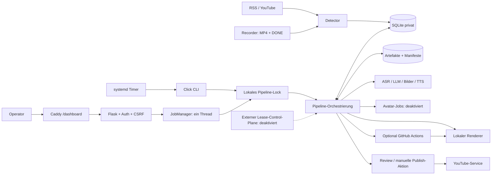
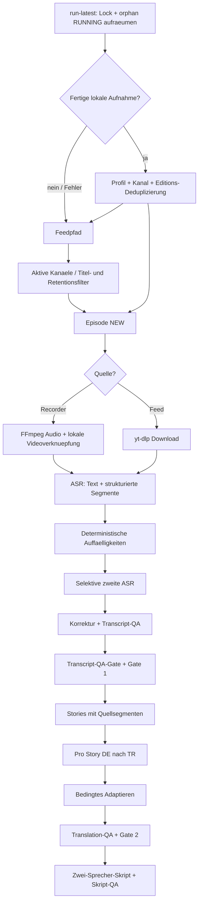
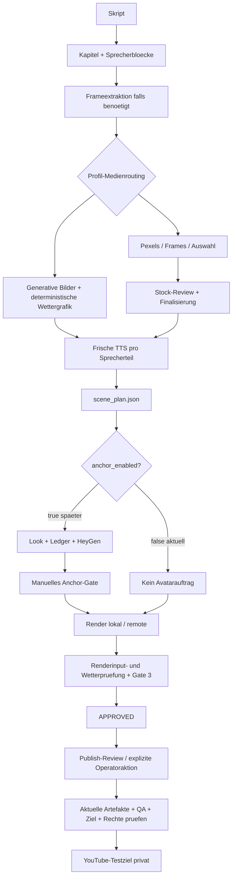

# ALMANYA24: belegter Ist-Zustand

[Einstieg](../../plans/almanya24-news-platform.md) | [Befunde](findings.md) | [Recherche](research.md) | [Zielarchitektur](../../plans/almanya24-news-platform/architecture.md) | [Arbeitspakete](../../plans/almanya24-news-platform/work-packages.md)

## 1. Geltung und Nachweisniveau

Untersuchung am 09.09.2026. Repository:
`~/AI-Startup-Lab/bitcoin-education`, Branch `main`,
Commit `1c229ccb083a444c9b6920e3a5cd95dd0095a110`.
Zu Beginn sauber; Vergleich mit der bereits vorhandenen lokalen
Remote-Tracking-Referenz `origin/main`: `0 0`. Kein Fetch in diesem Planauftrag:
Der aktuelle Stand des GitHub-Servers wurde nicht separat festgestellt.

Kennzeichnungen:

| Kennung | Bedeutung |
| --- | --- |
| I | Im aktuellen Code implementiert und an angegebenen Stellen untersucht |
| R | In dieser Untersuchung am laufenden System lesend festgestellt |
| D | Implementiert, aber aktuell deaktiviert oder durch Betreiberfreigabe blockiert |
| Z | Vorschlag; noch keine implementierte Funktion |
| U | Unbekannt, nicht ausgefuehrt oder nicht abschliessend untersucht |

Eine vorhandene Testdatei ist kein Nachweis eines heute erfolgreichen Testlaufs.
Fruehere Angaben zu 3.876/3.898/3.915 Tests sind historische Hinweise zu anderen
Stichtagen. Hier wurde keine vollstaendige Suite, kein Render und kein
Provider-Pilot gestartet. Kleine Fehlerreproduktionen liefen nur in
In-Memory-Datenbanken mit gemockten Feeds und gemocktem Dateiloeschen.

Gelesen wurden die Root- und Bereichsinstruktionen fuer core, models, web,
services, prompts und tests, relevante Profil-, Deployment-, Editorial-,
Avatar-/Release-, Medien-Roadmap- und Renderintegritaetsdokumente.
Es erfolgte kein neuer Secret-Scan aller historischen Commits und kein
Penetrationstest. In dieser Planung wurden keine Geheimnisse benoetigt.

## 2. Was das System heute ist

Ein profilgesteuerter **Video-Produktionsmonolith**, kein allgemeines
Redaktionssystem und noch keine oeffentliche Nachrichtenwebsite.
Python/Click steuert einen SQLAlchemy-/SQLite-Datenbestand und dateibasierte
Produktionsartefakte. Flask liefert das interne Operator-Dashboard.
Externe Dienste erzeugen Transkription, Text, Medien, Stimmen und optional Avatare.
FFmpeg/HTML/SVG/Pillow erstellen das Video.

Das tragfaehige Fundament sind Story-Segmentierung, Sprach-/Quellenbezuege,
persistente Produktionslaeufe, Reviewaufgaben, Medienmanifeste,
Inhalts-Hashes und geschuetzte Publikationsgrenzen. Das fehlende Fundament
fuer die Erweiterung sind unabhaengige Belege pro Aussage, mehrquellige
Themen, dauerhaft erhaltene Rechteentscheidungen und Artikelrevisionen.

### Heutiger Laufzeitschnappschuss

Nur `Settings` und YAML lesend geladen; die Datenbank wurde mit SQLite
`mode=ro` und `query_only=ON` geoeffnet. Nicht `create_app()` oder den CLI-Start
als vermeintlich lesende Abkuerzung verwendet: beide initialisieren DB-Strukturen.

| Gegenstand | Heute festgestellt |
| --- | --- |
| Git | Sauber, `main`, obiger Commit |
| Web und Caddy | Beide `active/running` |
| Run-/Detect-Timer | Beide `active/waiting`; waehrend der Planung nicht angehalten oder ausgeloest |
| HTTP | Lokal Health 200; Proxy-Login 200; anonyme Episoden-API 401 |
| Authentifizierter Browserablauf, CSRF, visuelle Vorschau | U; in dieser Untersuchung nicht neu ausgefuehrt |
| Laufzeit | Python 3.13.5, aarch64; Projekt fordert mindestens Python 3.12 |
| RAM/Swap | Momentaufnahme: 7.819 MiB RAM, 4.229 MiB verfuegbar; 2.028/2.047 MiB Swap belegt. Kein Beleg fuer akuten OOM, aber wenig Swap-Reserve |
| DB | `quick_check=ok`, 21 verzeichnete Migrationen |
| Episoden | 23 `bitcoin_podcast` auf `default`: 20 NEW, 3 ADAPTED; 10 `tagesschau_tr` auf `tagesschau`: APPROVED |
| Reviews | U.a. 10 offene Publish-Reviews; APPROVED ist nicht gleich menschlich geprueft |
| Historische Inkonsistenz | 184 PipelineRun-Zeilen ohne existierende Episode |
| Avatar-/Publish-Jobs | Beide Tabellen leer im aktuellen Bestand; keine Aussage ueber bereits geloeschte historische Daten |
| Flags | `anchor_enabled=false`, Profil `auto_publish=false`, `auto_approve_reviews=true` |
| Weitere Flags | `failover_enabled=false`, `copilot_auto_fix_enabled=true` |
| Renderhistorie | Neueste SUCCESS-Renderzeilen nennen `1c229cc`; allein kein visueller Qualitaetsnachweis und kein Nachweis aller laufenden Prozessversionen |

Kein bezahlter Aufruf, Upload, Loginversuch, Dienstneustart oder Deployment
wurde fuer diese Bestandsaufnahme ausgefuehrt. Laufende Timer bleiben
eigenstaendige Betriebsvorgaenge; ihre Aktivitaet darf nicht dieser Analyse
zugerechnet werden.

## 3. Diagramm 1: bestehende Systemarchitektur

Knotenzuordnung zum Repository:

| Knoten | Dateien / Funktionen |
| --- | --- |
| CLI/Timer | `pyproject.toml:[project.scripts]`; `btcedu/cli.py:cli`, `run_latest_cmd`, `run_pending_cmd`; `deploy/btcedu-run.service`, `btcedu-detect.service`, jeweilige Timer |
| PROXY/WEB | `deploy/Caddyfile.dashboard`; `web/app.py:create_app`, `_ConfiguredPrefixOnly`; `web/auth.py:init_auth`; `auth_routes.py`; tatsaechlicher Proxy hier durch HTTP-Verhalten, nicht erneutes Lesen privater Caddy-Konfiguration geprueft |
| JOB/LOCK | `web/jobs.py:JobManager._execute` (Lock ab ca. 282), `_execute_batch`; `core/runlock.py:pipeline_lock` |
| DET/FEED/REC | `core/detector.py:detect_episodes`, `detect_local_recordings`, `detect_all_active_channels`; `services/feed_service.py`; `local_recorder_service.py:scan_recordings`, `_recording_from_marker` |
| PIPE/FAILOVER | `core/pipeline.py:run_episode_pipeline`, `run_episode_pipeline_coordinated`; `failover/coordination.py` |
| DB/FILES | `db.py`, `models/`, `migrations/__init__.py`; `Settings` fuer raw/transcripts/outputs/reports/logs |
| PROVIDERS/AV | `services/claude_service.py:call_claude`; ASR-/TTS-/Bildadapter; `core/anchor_generator.py`, `avatar_coordinator.py`, `avatar_jobs.py` |
| RENDER/REMOTE | `core/renderer.py:render_video`; `scene_renderer.py`; `remote_render.py:build_job_package`, `render_video_remote`; `scripts/render_job.py` |
| REVIEW/YT | `core/reviewer.py`, `publisher.py:publish_video`; `services/youtube_service.py` |

Reviewfrage: Welche Arbeit muss prozessuebergreifend dauerhaft sein?
Heute ueberleben DB-/Providerjobs, aber nicht die reine In-Memory-Webqueue.
Die redaktionelle Recherche braucht einen eigenen dauerhaften Jobzustand;
dafuer ist weder ein neuer Broker noch ein kompletter Plattformneubau zwingend.

## 4. Diagramm 2: bestehender fachlicher Fluss

### Import bis freigegebene Narration

Nicht jede Episode durchlaeuft jede Box: `_get_stages()` in
`core/pipeline.py:83-183` setzt profilabhaengig Segmentierung, Skript und
alternative Gates ein. Die gezeichnete Hauptlinie gilt fuer das aktuelle
`tagesschau_tr`. Zweite ASR vergleicht Transkriptionen derselben Aufnahme,
nicht unabhaengige Berichte ueber das Ereignis.

Zuordnung: Import `detector.py:161-403,470-630`, lokaler Download
`_ingest_local_recording`, `local_recorder_service.extract_audio`;
ASR `transcriber.py:40`, Analyse `transcript_analyzer.py:156`,
Vergleich `transcript_verifier.py`; Korrektur `corrector.py:179`;
Segmente `segmenter.py:51`; Sprache `translator.py`, `adapter.py`,
`translation_qa.py:487,650`, `qa_reviewer.py`;
Skript `scripter.py:927`, `script_qa.py`.

Reviewfragen: Passt die Sendung wirklich zum Kanal? Bezeichnen zwei
Datumsangaben dieselbe Edition? Bedeutet ein QA-Gruen nur Quelltreue?
Die reproduzierten Importprobleme stehen in [Befunde](findings.md).

### Narration bis Video und Veroeffentlichung

Zuordnung: `chapterizer.py`, `frame_extractor.py`;
`image_generator.py`, `stock_images.py:274,553,1208,1311`;
`tts.py`, `scene_planner.py`;
`anchor_generator.py:111,558,688`, `avatar_jobs.py:131,176,270`,
`avatar_coordinator.py:206,1088`;
`pipeline.py:1450ff,1485-1720`, `renderer.py:175,1603,1948`,
`publisher.py:publish_video`.

Aktuell ist Bildrouting **generativ**, nicht generell Pexels; Wetter ist
deterministisch. Ein Studio-Szenenplan wird bei deaktiviertem Avatar im
Renderer ignoriert, der etablierte Kapitelpfad bleibt erhalten
(`renderer.py:1948-1996`). Der eingeschaltete Avatarpfad kauft nur
Moderatorinnenszenen; die Wetteruebergabe der Moderatorin ist etwas anderes
als der avatarfreie Wetterblock. Finales Audio stammt aus TTS, nicht HeyGen.

Der Profilwert `auto_approve_reviews=true` automatisiert mehrere Gates,
einschliesslich Gate 3 nach technischen Pruefungen. Das Anchor-Gate ist
ausgenommen. `auto_publish=false` verhindert den automatischen Upload auch
nach erteilter Publish-Freigabe (`pipeline.py:1665-1704`).
Es existiert derzeit keine automatische externe Faktenverifikation.

### Fehler, Eingriffe, Wiederaufnahme und Cleanup

| Fall | Heutiger Ablauf | Grenze |
| --- | --- | --- |
| Stufenfehler | PipelineRun/Fehlertext/Retryzaehler; Klassifizierung, ggf. Dead Letter und Benachrichtigung; Lauf stoppt | `PipelineReport.success` bedeutet auch kontrollierte Reviewpause, nicht vollstaendige Publikation |
| Automatische Reparatur | Fehlerpfad kann `core/copilot_fix.py` starten; Fehlerfingerprint verhindert identische Wiederholung; Tool darf laut generiertem Auftrag committen/pushen und Episode fortsetzen | Heute aktiviert; neue untrusted Webrecherche darf nie diesen Reparaturpfad aufrufen |
| Neustart | Timer nimmt lokales Lock, markiert verwaiste RUNNING-Laeufe unterbrochen, waehlt fortsetzbare Episoden | Wartende Webqueue im Prozess ist nicht dauerhaft |
| Retry/Force | `pipeline.retry_episode`, profilabhaengige Ruecksetzung; einzelne Stufen pruefen eigene Hashes | `force` ist keine allgemeine Garantie, alle Abhaengigkeiten korrekt neu zu pruefen |
| Avatarabbruch | Reservation vor Kauf, Job-ID sofort nach Annahme, Poll/Download statt Neukauf; unklarer Ausgang verlangt Reconciliation | Gilt fuer Avatarledger, nicht pauschal fuer jede LLM-/Bild-/TTS-Anfrage |
| Publishabbruch | Persistenter PublishJob pro Ziel; unklarer UPLOADING-Ausgang blockiert Wiederkauf/Upload | Schon publizierte externe Inhalte werden durch lokale Aenderungen nicht zurueckgezogen |
| Manuelle Textaenderung | Reviewentscheidungen und `review/*.reviewed.*`-Sidecars, Feedback in Wiederholung | Kein universeller themen-/kanaluebergreifender Revisionsgraph |
| Medienaenderung | Manifeste, Auswahl und `.stale`-Marker; Renderinput-Bytes werden an spaeteren Grenzen geprueft | Rechtefreigabe ist nicht Teil einer allgemeinen Medienrechte-Domaene |
| Cleanup | `detect_episodes` ruft Retention auf; Profilfrist 10 Tage; aktive PipelineRun-Zeile schuetzt | Erst Dateien, dann DB; ungeloste Avatarjobs/Publikationsbelege nicht ausreichend geschuetzt |

## 5. Daten, Integritaet und Kosten

`Channel.channel_id` und `Episode.channel_id` sind Strings; der Channel hat
zusaetzlich einen Integer-PK. Die Episodenzuordnung ist **kein DB-Foreign-Key**.
`content_profile` bedeutet Produktionskonfiguration, nicht Rubrik oder
redaktionelles Thema. Beides sollte im Ziel getrennt bleiben.

`Episode` besitzt einen global eindeutigen `episode_id`; `PipelineRun` nutzt
den Integer-Episoden-PK. `ReviewTask`, `ContentArtifact`, `MediaAsset`,
`PublishJob` und Avatarledger verwenden zumeist String-Episodenreferenzen.
`MediaAsset` besitzt eigene SQLAlchemy-Metadata. Stories, Transkriptsegmente,
Kapitel und Szenen sind ueberwiegend strukturierte Dateien/Pydantic-Modelle,
keine normalisierten redaktionellen DB-Objekte.

Migrationen: abstrakte `Migration`, Versionstabelle, check-before-act,
21 registrierte Schritte; letzte Migration repariert widerspruechliche
Kanal-/Profilzuordnungen. Aktuelle DB wurde nur gelesen, nicht migriert.

Byte-Integritaet ist gut ausgebaut: `render_inputs`, `render_guard`,
`render_environment`; nachgelagerte Grenzpruefungen bei Remote-Paket,
Ruecknahme, Review und Publish. Systeminputs werden maschinenbezogen
dokumentiert. Die alte Manifest-Lesbarkeit ist **keine** Freigabe:
`publisher._check_render_valid` und `renderer.render_is_current` pruefen
aktuelle Hashes zusaetzlich zum toleranten Einzelcheck fuer Legacy-Manifeste.
`tests/test_render_input_legacy.py:202-431` untersucht genau diese Kette.
Hier kein neuer erfolgreicher Legacy-Bypass behauptet.

Kosten: globale Episodenschranke (Settings-Default 15 USD; kein behaupteter
Live-Wert), Profil-TTS-Budget 6 USD, Avatarprofil 7 USD bei 0.0167 USD/s,
maximal drei Avatarjobs. Avatarreservierungen und ungeklaerte Ausgaenge
zaehlen mit. Andere Stufen pruefen oft kumulierte PipelineRun-Kosten;
daraus folgt kein atomarer universeller Kosten-Ledger fuer zukuenftige
Recherchejobs. TTS bewusst frisch, kein allgemeiner Take-Cache.

## 6. Untersuchungsgrenzen

Untersucht: die durchgaengigen Import-/Pipeline-/Review-/Publishpfade,
wesentliche Adapter und Datenvertraege, aktuelle Profilschalter,
ausgewaehlte Testfaelle, Auth-/Proxyarchitektur und sichere Laufzeitaggregate.
Nicht: jede Zeile der grossen Renderer-/API-Module, alle Browserinteraktionen,
vollstaendige Restored-DB-Tests, lizenzrechtliche Einzelfallentscheidung,
geografische Rechtepruefung, Medienqualitaet oder echte Providerabrechnung.

`pipeline.py` hat 2.383, `renderer.py` 2.373, `web/api.py` 5.532 und
`web/static/app.js` 4.476 Zeilen. Erweiterungen sollten an schmalen
Schnittstellen erfolgen, nicht durch weitere grosse Zweige in diesen Dateien.
Diese Groesse allein rechtfertigt keine Neuentwicklung.
