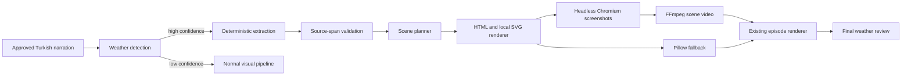

# Deterministic Weather Renderer

The `tagesschau_tr` profile renders weather chapters locally from the approved
Turkish narration. It does not query weather services or use generative image
models.

## Architecture



The implementation lives in `btcedu/core/weather/`. `imagegen` invokes it only
for positively detected weather chapters. All extracted values retain source
spans, and unsupported claims block the weather asset.

## Data flow and artifacts

For a weather chapter named `ch12`, image generation writes:

- `images/ch12_weather.json`: versioned structured weather data
- `images/ch12_weather_detection.json`: confidence and evidence
- `images/ch12_weather_validation.json`: grounding findings
- `images/ch12_weather_scenes.json`: narration-duration scene plan
- `images/ch12_weather.png`: validated static fallback/full card
- `images/ch12_weather.mp4`: timed scene video when animation is enabled
- matching `.provenance.json` files and the normal image manifest entry

The video contains no audio. The existing renderer loops or trims it to the
actual TTS duration and adds the approved TTS audio, overlays, transitions, and
ticker.

## Schema and grounding

`WeatherData` is a Pydantic model with schema versioning, regions, conditions,
temperatures, warnings, outlook, unresolved claims, and exact source spans.
Extraction is regex/lexicon based. No external weather data is allowed.

Regional conditions are associated at clause level. Ambiguous statements are
stored as unresolved rather than assigned. Signed temperatures, including the
Unicode minus sign, are supported.

## Profile configuration

The configuration is under `stage_config.weather` in
`btcedu/profiles/tagesschau_tr.yaml`:

```yaml
weather:
  enabled: true
  detection:
    min_confidence: 0.75
  extraction:
    provider: deterministic
    require_source_spans: true
    allow_external_weather_data: false
  rendering:
    engine: html_svg_chromium
    resolution: {width: 1920, height: 1080}
    fps: 25
    template: germany_news_v1
    animation_level: subtle
  branding:
    title: "Hava Durumu"
    accent_color: "#004B87"
  fallback:
    allow_generic_weather_template: true
    allow_general_story_fallback: true
    prohibit_blank_frames: true
  review:
    block_on_unsupported_claim: true
    block_on_blank_visual: true
```

Set `animation_level: none` to retain only the static card.

## CLI

Regenerate weather chapters through the normal image manifest and stale-marker
flow:

```bash
btcedu weather-render EPISODE_ID --force
btcedu weather-render EPISODE_ID --chapter-id CHAPTER_ID --force
```

Create a local fixture preview without changing an episode:

```bash
btcedu weather-render weather-preview \
  --narration "Kuzey ve doğuda sağanak, güneybatıda güneş bekleniyor. Sıcaklıklar 20 ile 29 derece arasında." \
  --force
```

## Dashboard

The episode weather panel reads the persisted artifacts and shows detection,
narration, structured JSON, source spans, validation findings, scene plan,
preview asset, fallback, renderer version, and cache state. Rerender actions
only invoke image generation; they never publish an episode.

## Fallbacks and review

The fallback order is:

1. Chromium-rendered structured weather card and timed scene video
2. Pillow card containing confirmed structured claims
3. reduced confirmed-claim card
4. branded generic card containing only grounded narration text

Each generated image is checked for existence, minimum size, readability, and
pixel variance. Final review additionally checks the rendered weather interval
for missing, stale, blank, white, black, transparent, long-frozen, or
duration-mismatched visuals. Critical findings block publishing.

## Cache and invalidation

Cache keys include schema and renderer versions, profile/configuration,
narration and structured-data hashes, scene plan, resolution, accent color,
title, template, and local SVG assets. A change reruns image generation and
rendering only; transcription, translation, adaptation, and TTS remain current.

## Raspberry Pi operation

The renderer uses the installed `chromium` binary directly in headless mode and
does not require Playwright or browser downloads. FFmpeg must provide
`libx264`, `concat`, `fade`, `scale`, and `pad`.

Measured on the production Raspberry Pi:

- full 1920x1080 Chromium card: approximately 3-6 seconds
- 12-second, three-scene H.264 preview: approximately 22 seconds
- peak browser use is transient; no browser process is retained

Both remain below the 60-second weather-render target.

## Development and tests

```bash
pytest tests/test_weather_renderer.py -q
pytest tests/test_web_weather.py -q
ruff check btcedu/ tests/
ruff format --check btcedu/ tests/
```

All external processes are mocked in unit tests. A local smoke test should also
exercise the installed Chromium and FFmpeg binaries before deployment.

Fixture preview assets for the implementation run are stored outside the
repository under the Copilot session `files/weather-preview/` directory. They
include a full PNG, timed MP4, generic fallback PNG, structured JSON, and scene
plan JSON.

## Existing episodes, migration, and rollback

No database migration is required. Regenerate an existing episode with
`btcedu weather-render EPISODE_ID --force`; only imagegen and downstream render
artifacts become stale.

Rollback consists of disabling `stage_config.weather.enabled` and reverting the
weather integration commit. Existing PNG/MP4 artifacts remain ordinary media
files and can be removed per episode. Earlier transcription, translation,
adaptation, chapter, and TTS artifacts are unaffected.

## Known limitations

- Scene timing is proportional to chapter narration duration because the
  chapter schema has no word timestamps.
- The Germany SVG is an original simplified directional silhouette, not a
  meteorological boundary map.
- Complex unsupported grammar remains unresolved and is never inferred.
- Browser reuse is intentionally avoided to keep failure isolation simple on
  the Raspberry Pi; one weather chapter starts a small number of short-lived
  Chromium processes.
